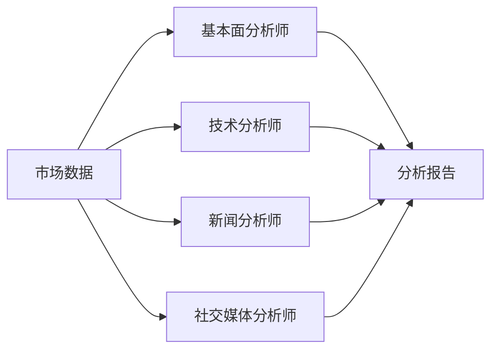
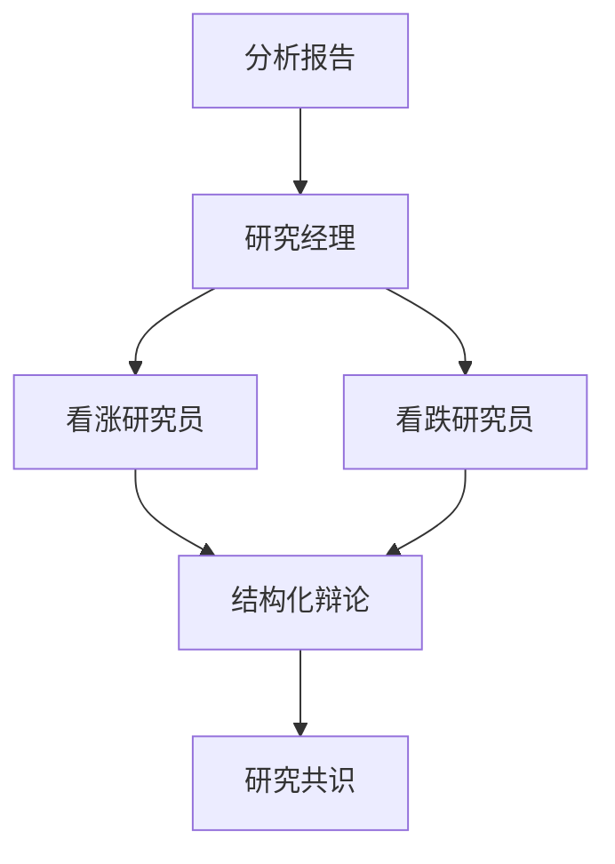
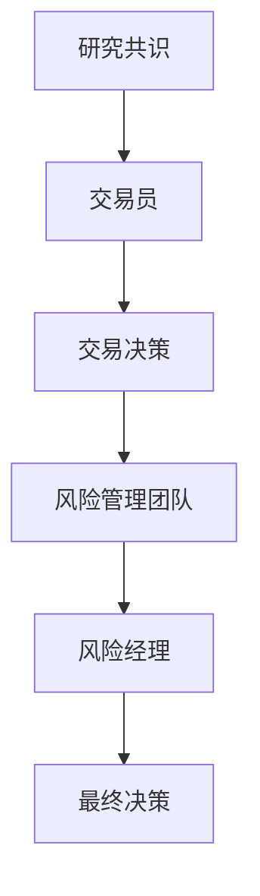

# 智能体架构设计

## 概述

TradingAgents 框架采用专业化的多智能体架构，每个智能体都有明确的职责和专业领域。智能体之间通过结构化的通信协议进行协作，形成一个完整的金融决策系统。

## 智能体设计模式

### 基础智能体类

```python
class BaseAgent:
    """所有智能体的基础类"""
    
    def __init__(self, llm, config):
        self.llm = llm
        self.config = config
        self.memory = AgentMemory()
        self.tools = self._initialize_tools()
    
    def process(self, state: AgentState) -> AgentState:
        """处理输入状态并返回更新后的状态"""
        pass
    
    def _initialize_tools(self):
        """初始化智能体专用工具"""
        pass
```

### 智能体状态管理

```python
class AgentState:
    """智能体状态数据结构"""
    
    ticker: str                    # 股票代码
    date: str                     # 分析日期
    analyst_reports: Dict         # 分析师报告
    research_reports: Dict        # 研究员报告
    trader_decision: Dict         # 交易决策
    risk_assessment: Dict         # 风险评估
    portfolio_decision: Dict      # 投资组合决策
    messages: List[BaseMessage]   # 消息历史
```

## 智能体分类与职责

### 1. 分析师团队 (Analysts)

#### 基本面分析师 (Fundamentals Analyst)
```python
class FundamentalsAnalyst(BaseAgent):
    """基本面分析师 - 分析公司财务和基本面数据"""
    
    专业领域:
    - 财务报表分析
    - 估值模型计算
    - 行业对比分析
    - 盈利能力评估
    
    输入数据:
    - 财务报表数据
    - 行业数据
    - 宏观经济指标
    
    输出结果:
    - 基本面评分
    - 估值建议
    - 财务健康度评估
```

#### 技术分析师 (Market Analyst)
```python
class MarketAnalyst(BaseAgent):
    """技术分析师 - 分析技术指标和价格趋势"""
    
    专业领域:
    - 技术指标计算 (RSI, MACD, 布林带等)
    - 趋势分析
    - 支撑阻力位识别
    - 交易信号生成
    
    输入数据:
    - 历史价格数据
    - 交易量数据
    - 技术指标数据
    
    输出结果:
    - 技术分析评分
    - 趋势方向判断
    - 关键价位识别
```

#### 新闻分析师 (News Analyst)
```python
class NewsAnalyst(BaseAgent):
    """新闻分析师 - 分析新闻事件和宏观因素"""
    
    专业领域:
    - 新闻情感分析
    - 事件影响评估
    - 宏观经济分析
    - 政策影响分析
    
    输入数据:
    - 新闻文章
    - 经济数据发布
    - 政策公告
    
    输出结果:
    - 新闻情感评分
    - 事件影响评估
    - 宏观趋势判断
```

#### 社交媒体分析师 (Social Media Analyst)
```python
class SocialMediaAnalyst(BaseAgent):
    """社交媒体分析师 - 分析社交媒体情绪"""
    
    专业领域:
    - 社交媒体情感分析
    - 舆论趋势监测
    - 热点话题识别
    - 投资者情绪评估
    
    输入数据:
    - Reddit 讨论数据
    - Twitter 情感数据
    - 论坛讨论内容
    
    输出结果:
    - 社交情感评分
    - 舆论趋势分析
    - 投资者情绪指标
```

### 2. 研究员团队 (Researchers)

#### 看涨研究员 (Bull Researcher)
```python
class BullResearcher(BaseAgent):
    """看涨研究员 - 从乐观角度评估投资机会"""
    
    职责:
    - 识别积极因素
    - 评估上涨潜力
    - 提供乐观预期
    - 挑战悲观观点
    
    分析重点:
    - 增长机会
    - 市场优势
    - 正面催化剂
    - 估值吸引力
```

#### 看跌研究员 (Bear Researcher)
```python
class BearResearcher(BaseAgent):
    """看跌研究员 - 从悲观角度评估投资风险"""
    
    职责:
    - 识别风险因素
    - 评估下跌风险
    - 提供谨慎预期
    - 挑战乐观观点
    
    分析重点:
    - 潜在风险
    - 市场威胁
    - 负面催化剂
    - 估值过高风险
```

### 3. 交易执行 (Trader)

#### 交易员 (Trader)
```python
class Trader(BaseAgent):
    """交易员 - 制定最终交易决策"""
    
    职责:
    - 综合各方分析
    - 制定交易策略
    - 确定仓位大小
    - 设置止损止盈
    
    决策因素:
    - 分析师报告
    - 研究员辩论结果
    - 风险评估
    - 市场条件
```

### 4. 风险管理团队 (Risk Management)

#### 风险评估智能体
```python
class RiskDebator(BaseAgent):
    """风险评估智能体基类"""
    
    风险评估维度:
    - 市场风险
    - 流动性风险
    - 信用风险
    - 操作风险
    
    评估方法:
    - VaR 计算
    - 压力测试
    - 情景分析
    - 相关性分析
```

- **激进风险评估**: 支持高风险高收益策略
- **保守风险评估**: 强调风险控制和资本保护
- **中性风险评估**: 平衡风险和收益

### 5. 管理层 (Managers)

#### 研究经理 (Research Manager)
```python
class ResearchManager(BaseAgent):
    """研究经理 - 协调研究员团队工作"""
    
    职责:
    - 组织研究员辩论
    - 平衡不同观点
    - 形成研究共识
    - 质量控制
```

#### 风险经理 (Risk Manager)
```python
class RiskManager(BaseAgent):
    """风险经理 - 管理整体风险控制"""
    
    职责:
    - 协调风险评估
    - 制定风险政策
    - 监控风险指标
    - 最终风险决策
```

## 智能体交互模式

### 1. 并行分析阶段


### 2. 研究辩论阶段


### 3. 交易决策阶段


## 智能体通信协议

### 消息格式
```python
class AgentMessage:
    sender: str           # 发送者ID
    receiver: str         # 接收者ID
    message_type: str     # 消息类型
    content: Dict         # 消息内容
    timestamp: datetime   # 时间戳
    priority: int         # 优先级
```

### 通信类型
1. **分析报告**: 分析师向系统提交分析结果
2. **辩论消息**: 研究员之间的观点交换
3. **决策请求**: 请求其他智能体提供意见
4. **风险警告**: 风险管理团队的风险提醒
5. **最终决策**: 最终的交易决策通知

## 智能体配置

### 配置参数
```python
agent_config = {
    "llm_model": "gpt-4o",           # 使用的LLM模型
    "temperature": 0.1,              # 生成温度
    "max_tokens": 2000,              # 最大token数
    "tools_enabled": True,           # 是否启用工具
    "memory_enabled": True,          # 是否启用记忆
    "debate_rounds": 3,              # 辩论轮数
    "confidence_threshold": 0.7,     # 置信度阈值
}
```

### 专业化配置
每个智能体都有特定的配置参数，以优化其专业领域的表现：

- **分析师**: 专注于数据分析和模式识别
- **研究员**: 优化辩论和批判性思维
- **交易员**: 强化决策制定和风险评估
- **风险管理**: 专注于风险识别和量化

这种专业化的智能体架构确保了系统能够从多个角度全面分析市场，并通过协作机制形成高质量的投资决策。
