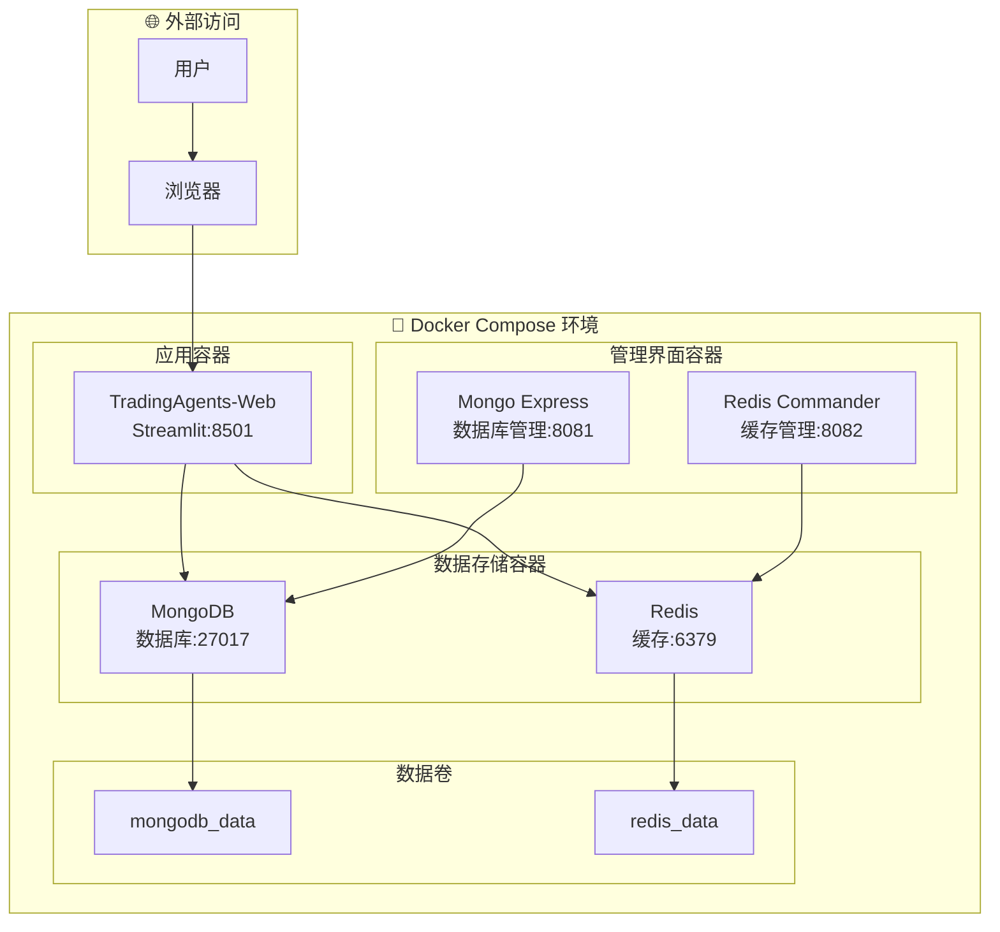
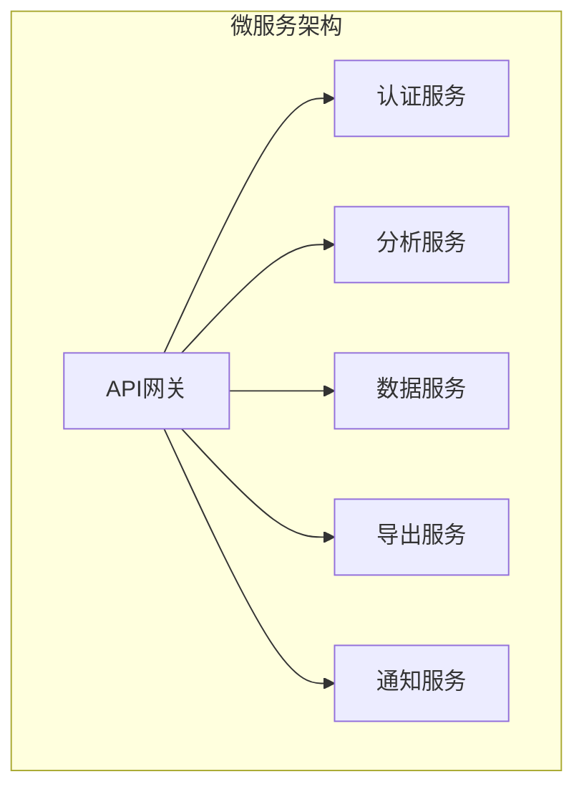

# 🐳 TradingAgents-CN 容器化架构设计

## 📋 概述

本文档详细描述了TradingAgents-CN v0.1.7版本引入的容器化架构设计，包括Docker Compose多服务编排、开发环境优化和生产部署策略。

## 🎯 容器化目标

### 解决的问题

1. **环境一致性**: 开发、测试、生产环境完全一致
2. **依赖管理**: 自动化依赖安装和版本管理
3. **快速部署**: 一键启动完整的应用栈
4. **服务隔离**: 各服务独立运行，故障隔离
5. **扩展性**: 支持水平扩展和负载均衡

### 实现效果

- ✅ **零配置启动**: `docker-compose up -d` 一键部署
- ✅ **开发友好**: Volume映射支持实时代码同步
- ✅ **监控完整**: 数据库和缓存管理界面
- ✅ **网络隔离**: 服务间安全通信
- ✅ **数据持久化**: 数据卷保证数据安全

## 🏗️ 容器化架构设计

### 整体架构图



### 服务组件详解

#### 1. 🌐 TradingAgents-Web (主应用)

```yaml
web:
  build: .
  ports:
    - "8501:8501"
  volumes:
    - .env:/app/.env
    - ./web:/app/web
    - ./tradingagents:/app/tradingagents
  depends_on:
    - mongodb
    - redis
  environment:
    - MONGODB_URL=mongodb://mongodb:27017/tradingagents
    - REDIS_URL=redis://redis:6379
```

**功能特性**:
- Streamlit Web界面
- 股票分析引擎
- 报告导出功能
- 实时数据处理

#### 2. 🗄️ MongoDB (数据持久化)

```yaml
mongodb:
  image: mongo:4.4
  ports:
    - "27017:27017"
  volumes:
    - mongodb_data:/data/db
  environment:
    - MONGO_INITDB_DATABASE=tradingagents
```

**存储内容**:
- 分析结果数据
- 用户配置信息
- 历史分析记录
- 股票基础信息

#### 3. ⚡ Redis (高速缓存)

```yaml
redis:
  image: redis:6-alpine
  ports:
    - "6379:6379"
  volumes:
    - redis_data:/data
```

**缓存内容**:
- 实时股价数据
- API响应结果
- 会话状态信息
- 热点数据预加载

#### 4. 📊 Mongo Express (数据库管理)

```yaml
mongo-express:
  image: mongo-express
  ports:
    - "8081:8081"
  environment:
    - ME_CONFIG_MONGODB_SERVER=mongodb
    - ME_CONFIG_MONGODB_PORT=27017
  depends_on:
    - mongodb
```

**管理功能**:
- 数据库可视化
- 集合管理
- 文档查询编辑
- 性能监控

#### 5. 🎛️ Redis Commander (缓存管理)

```yaml
redis-commander:
  image: rediscommander/redis-commander
  ports:
    - "8082:8081"
  environment:
    - REDIS_HOSTS=local:redis:6379
  depends_on:
    - redis
```

**管理功能**:
- 缓存数据查看
- 键值对管理
- 内存使用监控
- 性能分析

## 🔧 开发环境优化

### Volume映射策略

```yaml
volumes:
  # 环境配置
  - .env:/app/.env
  
  # 核心代码实时同步
  - ./web:/app/web
  - ./tradingagents:/app/tradingagents
  - ./scripts:/app/scripts
  
  # 测试工具
  - ./test_conversion.py:/app/test_conversion.py
```

### 开发工作流

1. **代码修改**: 本地编辑器修改代码
2. **自动同步**: Volume映射实时同步到容器
3. **热重载**: Streamlit自动检测变化并重载
4. **即时测试**: 浏览器刷新即可看到效果

### 调试支持

```bash
# 进入容器调试
docker exec -it TradingAgents-web bash

# 查看实时日志
docker logs TradingAgents-web --follow

# 执行测试脚本
docker exec TradingAgents-web python test_conversion.py
```

## 🌐 网络架构

### 服务发现

```yaml
networks:
  default:
    name: tradingagents_network
```

**特性**:
- 自动DNS解析
- 服务名访问
- 网络隔离
- 安全通信

### 端口映射

| 服务 | 内部端口 | 外部端口 | 用途 |
|------|---------|---------|------|
| Web应用 | 8501 | 8501 | 主界面访问 |
| MongoDB | 27017 | 27017 | 数据库连接 |
| Redis | 6379 | 6379 | 缓存连接 |
| Mongo Express | 8081 | 8081 | 数据库管理 |
| Redis Commander | 8081 | 8082 | 缓存管理 |

## 💾 数据持久化

### 数据卷设计

```yaml
volumes:
  mongodb_data:
    driver: local
  redis_data:
    driver: local
```

### 数据备份策略

```bash
# MongoDB备份
docker exec TradingAgents-mongodb mongodump --out /backup

# Redis备份
docker exec TradingAgents-redis redis-cli BGSAVE

# 数据卷备份
docker run --rm -v mongodb_data:/data -v $(pwd):/backup alpine tar czf /backup/mongodb_backup.tar.gz -C /data .
```

## 🚀 生产部署优化

### 资源限制

```yaml
services:
  web:
    deploy:
      resources:
        limits:
          cpus: '2.0'
          memory: 4G
        reservations:
          memory: 2G
```

### 健康检查

```yaml
healthcheck:
  test: ["CMD", "curl", "-f", "http://localhost:8501"]
  interval: 30s
  timeout: 10s
  retries: 3
  start_period: 40s
```

### 安全配置

```yaml
# 生产环境安全设置
environment:
  - MONGO_INITDB_ROOT_USERNAME=admin
  - MONGO_INITDB_ROOT_PASSWORD=${MONGO_PASSWORD}
  - ME_CONFIG_BASICAUTH_USERNAME=admin
  - ME_CONFIG_BASICAUTH_PASSWORD=${ADMIN_PASSWORD}
```

## 📊 监控和运维

### 服务监控

```bash
# 查看服务状态
docker-compose ps

# 查看资源使用
docker stats

# 查看服务日志
docker-compose logs -f web
```

### 性能优化

1. **内存优化**
   - 合理设置内存限制
   - 监控内存使用情况
   - 及时清理无用数据

2. **网络优化**
   - 使用内部网络通信
   - 减少不必要的端口暴露
   - 启用数据压缩

3. **存储优化**
   - 定期清理日志文件
   - 优化数据库索引
   - 使用SSD存储

## 🔮 未来规划

### 微服务拆分



### 云原生支持

- **Kubernetes**: 容器编排
- **Helm**: 应用包管理
- **Istio**: 服务网格
- **Prometheus**: 监控告警

### 扩展性增强

- **水平扩展**: 多实例负载均衡
- **自动伸缩**: 基于负载自动扩容
- **故障转移**: 高可用性保证

---

*最后更新: 2025-07-13*  
*版本: cn-0.1.7*  
*贡献者: [@breeze303](https://github.com/breeze303)*
