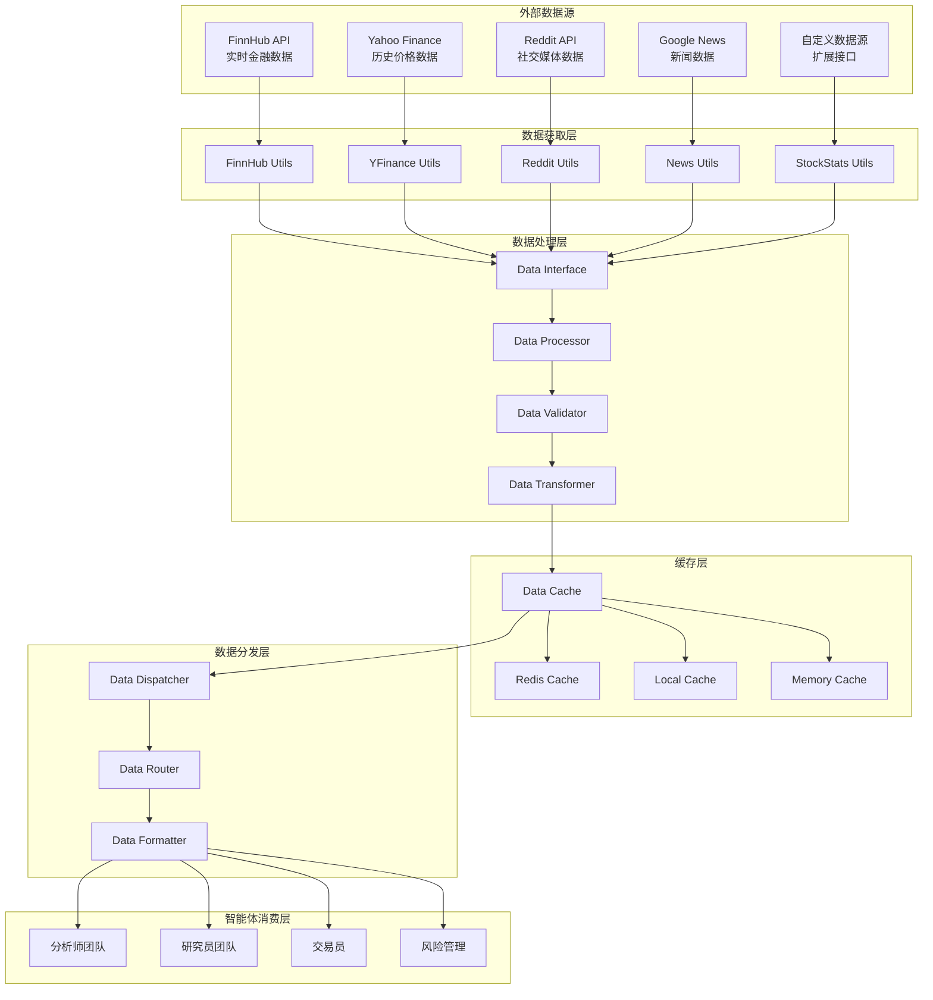

# 数据流架构

## 概述

TradingAgents 的数据流架构设计用于高效地获取、处理和分发金融数据。系统支持多种数据源，实现了统一的数据接口，并提供了强大的缓存和处理机制。

## 数据流架构图



## 数据源详解

### 1. FinnHub API
```python
class FinnHubUtils:
    """FinnHub 数据获取工具"""
    
    支持的数据类型:
    - 实时股价数据
    - 公司基本信息
    - 财务报表数据
    - 新闻和公告
    - 技术指标
    - 市场情绪指标
    
    API限制:
    - 免费版: 60 calls/minute
    - 付费版: 更高频率限制
    
    数据格式:
    {
        "symbol": "AAPL",
        "price": 150.25,
        "change": 2.15,
        "changePercent": 1.45,
        "timestamp": 1640995200
    }
```

### 2. Yahoo Finance
```python
class YFinanceUtils:
    """Yahoo Finance 数据获取工具"""
    
    支持的数据类型:
    - 历史价格数据
    - 股票分割信息
    - 股息数据
    - 期权数据
    - 财务指标
    
    优势:
    - 免费使用
    - 数据覆盖面广
    - 历史数据丰富
    
    数据格式:
    {
        "Date": "2024-01-01",
        "Open": 148.50,
        "High": 152.30,
        "Low": 147.80,
        "Close": 150.25,
        "Volume": 45678900
    }
```

### 3. Reddit API
```python
class RedditUtils:
    """Reddit 社交媒体数据获取工具"""
    
    支持的数据类型:
    - 热门帖子
    - 评论情感
    - 用户讨论热度
    - 关键词提及频率
    
    分析维度:
    - 情感极性 (正面/负面/中性)
    - 讨论热度
    - 用户参与度
    - 话题趋势
    
    数据格式:
    {
        "post_id": "abc123",
        "title": "AAPL earnings discussion",
        "score": 1250,
        "comments": 89,
        "sentiment": 0.65,
        "timestamp": 1640995200
    }
```

### 4. Google News
```python
class GoogleNewsUtils:
    """Google News 新闻数据获取工具"""
    
    支持的数据类型:
    - 相关新闻文章
    - 新闻情感分析
    - 事件时间线
    - 影响力评估
    
    处理流程:
    1. 关键词搜索
    2. 新闻筛选
    3. 内容提取
    4. 情感分析
    5. 影响力评估
    
    数据格式:
    {
        "title": "Apple reports strong Q4 earnings",
        "source": "Reuters",
        "published": "2024-01-01T10:00:00Z",
        "sentiment": 0.8,
        "relevance": 0.95,
        "impact_score": 0.7
    }
```

## 数据处理流程

### 1. 数据获取阶段
```python
class DataAcquisition:
    """数据获取协调器"""
    
    def fetch_data(self, symbol: str, date: str) -> Dict:
        """获取指定股票和日期的所有数据"""
        
        # 并行获取各类数据
        tasks = [
            self.fetch_price_data(symbol, date),
            self.fetch_fundamental_data(symbol),
            self.fetch_news_data(symbol, date),
            self.fetch_social_data(symbol, date),
            self.fetch_technical_data(symbol, date)
        ]
        
        # 等待所有任务完成
        results = await asyncio.gather(*tasks)
        
        # 整合数据
        return self.integrate_data(results)
```

### 2. 数据验证阶段
```python
class DataValidator:
    """数据验证器"""
    
    验证规则:
    - 数据完整性检查
    - 数据类型验证
    - 数值范围检查
    - 时间戳验证
    - 异常值检测
    
    def validate(self, data: Dict) -> Tuple[bool, List[str]]:
        """验证数据质量"""
        errors = []
        
        # 检查必需字段
        if not self.check_required_fields(data):
            errors.append("Missing required fields")
        
        # 检查数据类型
        if not self.check_data_types(data):
            errors.append("Invalid data types")
        
        # 检查数值范围
        if not self.check_value_ranges(data):
            errors.append("Values out of range")
        
        return len(errors) == 0, errors
```

### 3. 数据转换阶段
```python
class DataTransformer:
    """数据转换器"""
    
    转换功能:
    - 数据标准化
    - 单位统一
    - 格式转换
    - 特征工程
    - 数据聚合
    
    def transform(self, raw_data: Dict) -> Dict:
        """转换原始数据为标准格式"""
        
        transformed = {}
        
        # 价格数据标准化
        transformed['price_data'] = self.normalize_prices(
            raw_data['price_data']
        )
        
        # 财务数据转换
        transformed['financial_data'] = self.convert_financials(
            raw_data['financial_data']
        )
        
        # 情感数据聚合
        transformed['sentiment_data'] = self.aggregate_sentiment(
            raw_data['news_data'],
            raw_data['social_data']
        )
        
        return transformed
```

## 缓存策略

### 1. 多层缓存架构
```python
class CacheManager:
    """缓存管理器"""
    
    缓存层次:
    1. 内存缓存 (最快访问)
    2. 本地文件缓存 (持久化)
    3. Redis缓存 (分布式)
    4. 数据库缓存 (长期存储)
    
    def get_data(self, key: str) -> Optional[Dict]:
        """按优先级获取缓存数据"""
        
        # 1. 检查内存缓存
        if data := self.memory_cache.get(key):
            return data
        
        # 2. 检查本地缓存
        if data := self.local_cache.get(key):
            self.memory_cache.set(key, data)
            return data
        
        # 3. 检查Redis缓存
        if data := self.redis_cache.get(key):
            self.local_cache.set(key, data)
            self.memory_cache.set(key, data)
            return data
        
        return None
```

### 2. 缓存策略
```python
缓存配置:
{
    "price_data": {
        "ttl": 300,        # 5分钟过期
        "refresh": "auto"   # 自动刷新
    },
    "fundamental_data": {
        "ttl": 86400,      # 24小时过期
        "refresh": "manual" # 手动刷新
    },
    "news_data": {
        "ttl": 3600,       # 1小时过期
        "refresh": "auto"   # 自动刷新
    },
    "social_data": {
        "ttl": 1800,       # 30分钟过期
        "refresh": "auto"   # 自动刷新
    }
}
```

## 数据分发机制

### 1. 数据路由
```python
class DataRouter:
    """数据路由器"""
    
    路由规则:
    - 基本面数据 → 基本面分析师
    - 技术数据 → 技术分析师
    - 新闻数据 → 新闻分析师
    - 社交数据 → 社交媒体分析师
    - 综合数据 → 所有智能体
    
    def route_data(self, data: Dict, agents: List[str]) -> Dict:
        """根据智能体类型分发相应数据"""
        
        routed_data = {}
        
        for agent in agents:
            if agent == "fundamentals_analyst":
                routed_data[agent] = {
                    "financial_data": data["financial_data"],
                    "company_info": data["company_info"],
                    "industry_data": data["industry_data"]
                }
            elif agent == "technical_analyst":
                routed_data[agent] = {
                    "price_data": data["price_data"],
                    "volume_data": data["volume_data"],
                    "technical_indicators": data["technical_indicators"]
                }
            # ... 其他智能体的路由规则
        
        return routed_data
```

### 2. 数据格式化
```python
class DataFormatter:
    """数据格式化器"""
    
    def format_for_agent(self, data: Dict, agent_type: str) -> Dict:
        """为特定智能体格式化数据"""
        
        if agent_type == "fundamentals_analyst":
            return self.format_fundamental_data(data)
        elif agent_type == "technical_analyst":
            return self.format_technical_data(data)
        elif agent_type == "news_analyst":
            return self.format_news_data(data)
        elif agent_type == "social_analyst":
            return self.format_social_data(data)
        
        return data
```

## 性能优化

### 1. 并行处理
- 多线程数据获取
- 异步API调用
- 并行数据处理

### 2. 智能缓存
- 预测性缓存
- 热数据预加载
- 缓存命中率优化

### 3. 数据压缩
- 数据压缩存储
- 增量数据传输
- 数据去重

### 4. 错误处理
- 数据源故障转移
- 重试机制
- 降级策略

这种数据流架构确保了系统能够高效、可靠地处理大量金融数据，为智能体提供高质量的数据支持。
