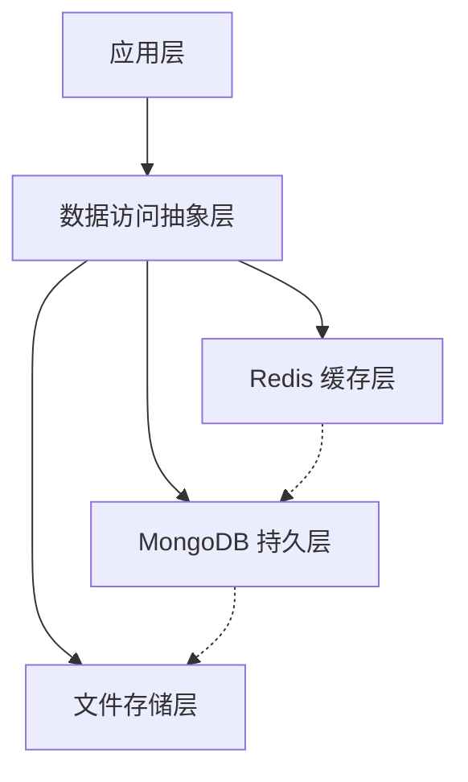
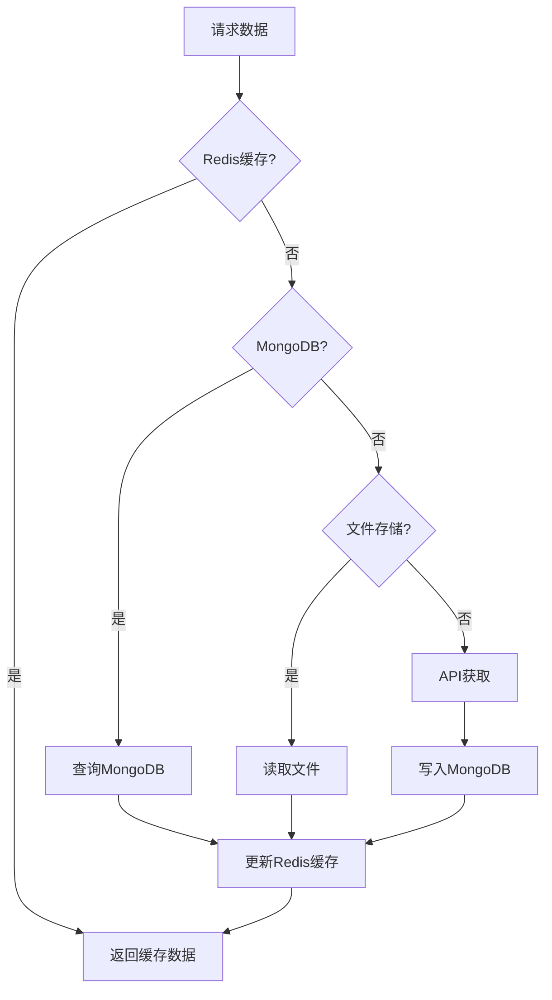
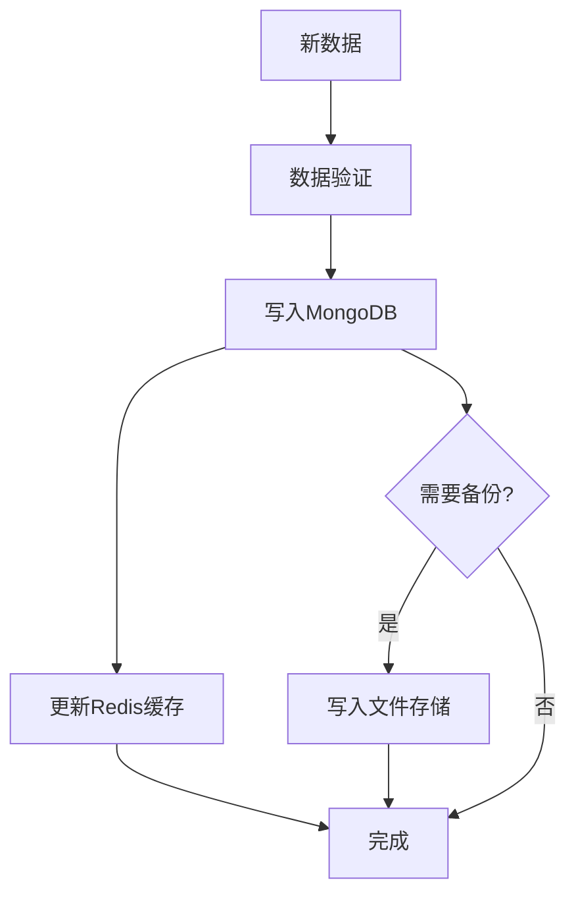

# TradingAgents-CN 数据库架构设计

## 1. 概述

本文档详细描述了 TradingAgents-CN 项目的数据库架构设计，包括 MongoDB 和 Redis 的集成方案。该架构旨在提供高性能、可扩展、高可用的数据管理解决方案，以支持多智能体交易系统的数据需求。

## 2. 架构概览

TradingAgents-CN 采用多层数据架构：



### 2.1 核心组件

| 组件 | 角色 | 主要职责 |
|-----|-----|---------|
| **Redis** | 缓存层 | 提供高速数据访问，减轻数据库负担 |
| **MongoDB** | 持久层 | 存储结构化和半结构化数据 |
| **文件存储** | 备份层 | 提供数据备份和历史归档 |
| **数据访问抽象层** | 中间层 | 统一数据访问接口，管理缓存策略 |

## 3. MongoDB 数据模型

### 3.1 数据库结构

```
mongodb://localhost:27017/tradingagents
├── market_data                # 集合：市场数据
│   ├── { symbol: "AAPL", date: "2023-05-15", open: 150.25, ... }
│   └── { symbol: "GOOGL", date: "2023-05-15", open: 2500.10, ... }
├── fundamental_data          # 集合：基本面数据
│   ├── { symbol: "AAPL", period: "2023Q1", revenue: 94.8, ... }
│   └── { symbol: "GOOGL", period: "2023Q1", revenue: 69.8, ... }
├── news_data                 # 集合：新闻数据
│   ├── { symbol: "AAPL", timestamp: "2023-05-15T08:30:00", title: "...", ... }
│   └── { symbol: "MARKET", timestamp: "2023-05-15T09:15:00", title: "...", ... }
├── social_data               # 集合：社交媒体数据
│   └── { symbol: "AAPL", source: "reddit", timestamp: "...", sentiment: 0.75, ... }
├── analysis_results          # 集合：分析结果
│   └── { symbol: "AAPL", date: "2023-05-15", analyst: "market", decision: "BUY", ... }
└── metadata                  # 集合：元数据
    ├── { type: "sync_status", last_update: "2023-05-15T10:00:00", ... }
    └── { type: "data_catalog", schema_version: "1.0", ... }
```

### 3.2 索引策略

| 集合 | 索引 | 类型 | 目的 |
|-----|-----|------|-----|
| **market_data** | `{ symbol: 1, date: 1 }` | 复合索引 | 快速查询特定股票的历史数据 |
| **market_data** | `{ date: 1 }` | 单字段索引 | 按日期查询市场数据 |
| **fundamental_data** | `{ symbol: 1, period: 1 }` | 复合索引 | 快速查询特定股票的财务数据 |
| **news_data** | `{ symbol: 1, timestamp: -1 }` | 复合索引 | 按时间倒序查询新闻 |
| **news_data** | `{ timestamp: -1 }` | 单字段索引 | 获取最新新闻 |
| **social_data** | `{ symbol: 1, timestamp: -1 }` | 复合索引 | 按时间倒序查询社交数据 |
| **analysis_results** | `{ symbol: 1, date: -1 }` | 复合索引 | 查询最新分析结果 |

### 3.3 文档模型示例

```json
// market_data 集合文档示例
{
  "_id": ObjectId("..."),
  "symbol": "AAPL",
  "market": "us",
  "date": "2023-05-15",
  "open": 150.25,
  "high": 152.30,
  "low": 149.80,
  "close": 151.75,
  "volume": 75482365,
  "adjusted_close": 151.75,
  "source": "finnhub",
  "created_at": ISODate("2023-05-15T20:00:00Z"),
  "updated_at": ISODate("2023-05-15T20:00:00Z")
}

// fundamental_data 集合文档示例
{
  "_id": ObjectId("..."),
  "symbol": "AAPL",
  "period": "2023Q1",
  "report_type": "income_statement",
  "currency": "USD",
  "revenue": 94800000000,
  "gross_profit": 41500000000,
  "net_income": 24160000000,
  "eps": 1.52,
  "source": "simfin",
  "filing_date": "2023-04-28",
  "created_at": ISODate("2023-04-28T18:30:00Z"),
  "updated_at": ISODate("2023-04-28T18:30:00Z")
}
```

## 4. Redis 缓存设计

### 4.1 键空间设计

```
Redis 实例 (localhost:6379)
├── ta:price:{symbol}:{timeframe}     # 价格数据缓存
├── ta:quote:{symbol}                 # 实时报价缓存
├── ta:news:{symbol}                  # 新闻数据缓存
├── ta:social:{symbol}                # 社交媒体数据缓存
├── ta:analysis:{symbol}:{analyst}    # 分析结果缓存
├── ta:stats:{symbol}                 # 统计数据缓存
├── ta:locks:{resource}               # 分布式锁
└── ta:jobs:{job_id}                  # 后台任务状态
```

### 4.2 数据结构与TTL策略

| 缓存键模式 | 数据类型 | TTL | 用途 |
|-----------|---------|-----|-----|
| `ta:price:{symbol}:daily` | Hash | 1天 | 日线价格数据 |
| `ta:price:{symbol}:intraday` | Hash | 5分钟 | 分钟级价格数据 |
| `ta:quote:{symbol}` | Hash | 1分钟 | 实时报价 |
| `ta:news:{symbol}` | List | 15分钟 | 最新新闻 |
| `ta:news:market` | List | 10分钟 | 市场新闻 |
| `ta:social:{symbol}` | Sorted Set | 5分钟 | 社交媒体情绪 |
| `ta:analysis:{symbol}:{date}` | Hash | 1小时 | 分析结果 |
| `ta:stats:{symbol}` | Hash | 1天 | 统计数据 |

### 4.3 数据结构示例

```
# 价格数据 (Hash)
HSET ta:price:AAPL:daily 2023-05-15 "{'open':150.25,'high':152.30,'low':149.80,'close':151.75,'volume':75482365}"
EXPIRE ta:price:AAPL:daily 86400

# 实时报价 (Hash)
HSET ta:quote:AAPL price 151.75 change 1.25 percent 0.83 volume 75482365 updated_at 1684180800
EXPIRE ta:quote:AAPL 60

# 新闻数据 (List)
LPUSH ta:news:AAPL "{'id':'n12345','title':'Apple Announces New iPhone','timestamp':'2023-05-15T14:30:00Z','source':'reuters'}"
EXPIRE ta:news:AAPL 900

# 社交媒体情绪 (Sorted Set，按时间戳排序)
ZADD ta:social:AAPL 1684180800 "{'source':'reddit','sentiment':0.75,'mentions':120,'timestamp':1684180800}"
EXPIRE ta:social:AAPL 300
```

## 5. 数据流设计

### 5.1 读取流程



### 5.2 写入流程



### 5.3 缓存同步策略

| 同步类型 | 触发条件 | 同步方向 | 实现方式 |
|---------|---------|---------|---------|
| **写入同步** | 数据更新 | API → MongoDB → Redis | 写入管道 |
| **缓存失效** | TTL过期 | MongoDB → Redis | 按需加载 |
| **定期同步** | 定时任务 | MongoDB → Redis | 后台任务 |
| **全量同步** | 系统启动 | MongoDB → Redis | 启动脚本 |

## 6. 数据访问层设计

### 6.1 抽象接口

```python
class DataAccess:
    """数据访问抽象层，统一管理MongoDB和Redis访问"""
    
    def __init__(self, config=None):
        self.config = config or DATABASE_CONFIG
        self.mongo_client = pymongo.MongoClient(self.config["mongodb"]["uri"])
        self.db = self.mongo_client[self.config["mongodb"]["db_name"]]
        self.redis_client = redis.Redis(
            host=self.config["redis"]["host"],
            port=self.config["redis"]["port"],
            db=self.config["redis"]["db"],
            password=self.config["redis"]["password"]
        )
        
    def get_price_data(self, symbol, start_date, end_date=None, timeframe="daily"):
        """获取价格数据，优先从缓存获取"""
        # 实现代码...
        
    def get_fundamental_data(self, symbol, period=None, report_type=None):
        """获取基本面数据"""
        # 实现代码...
        
    def get_news_data(self, symbol=None, start_time=None, limit=20):
        """获取新闻数据"""
        # 实现代码...
        
    def get_social_data(self, symbol, start_time=None, limit=20):
        """获取社交媒体数据"""
        # 实现代码...
        
    def get_analysis_results(self, symbol, date=None, analyst=None):
        """获取分析结果"""
        # 实现代码...
        
    def save_price_data(self, symbol, data, timeframe="daily"):
        """保存价格数据"""
        # 实现代码...
        
    # 其他数据访问方法...
```

### 6.2 分布式锁实现

```python
def acquire_lock(resource_name, timeout=10):
    """获取分布式锁"""
    lock_key = f"ta:locks:{resource_name}"
    lock_value = str(uuid.uuid4())
    
    # 尝试获取锁，设置过期时间防止死锁
    acquired = redis_client.set(lock_key, lock_value, nx=True, ex=timeout)
    
    if acquired:
        return lock_value
    return None

def release_lock(resource_name, lock_value):
    """释放分布式锁"""
    lock_key = f"ta:locks:{resource_name}"
    
    # 使用Lua脚本确保原子性操作
    script = """
    if redis.call('get', KEYS[1]) == ARGV[1] then
        return redis.call('del', KEYS[1])
    else
        return 0
    end
    """
    redis_client.eval(script, 1, lock_key, lock_value)
```

## 7. 配置设计

### 7.1 MongoDB 配置

```yaml
# MongoDB 配置文件
storage:
  dbPath: /var/lib/mongodb
  journal:
    enabled: true
  directoryPerDB: true
  wiredTiger:
    engineConfig:
      cacheSizeGB: 2
      journalCompressor: snappy

systemLog:
  destination: file
  path: /var/log/mongodb/mongod.log
  logAppend: true

net:
  port: 27017
  bindIp: 127.0.0.1

security:
  authorization: enabled

processManagement:
  timeZoneInfo: /usr/share/zoneinfo
```

### 7.2 Redis 配置

```
# Redis 配置文件
port 6379
bind 127.0.0.1
protected-mode yes

# 内存配置
maxmemory 1gb
maxmemory-policy allkeys-lru

# 持久化配置
appendonly yes
appendfsync everysec

# 超时配置
timeout 0

# 日志配置
loglevel notice
logfile /var/log/redis/redis-server.log

# 数据库数量
databases 16

# 性能优化
tcp-keepalive 300
```

### 7.3 应用配置

```python
DATABASE_CONFIG = {
    "mongodb": {
        "uri": "mongodb://localhost:27017/",
        "db_name": "tradingagents",
        "options": {
            "connectTimeoutMS": 5000,
            "socketTimeoutMS": 30000,
            "maxPoolSize": 50,
            "minPoolSize": 5
        },
        "collections": {
            "market_data": "market_data",
            "fundamental_data": "fundamental_data",
            "news_data": "news_data",
            "social_data": "social_data",
            "analysis_results": "analysis_results",
            "metadata": "metadata"
        }
    },
    "redis": {
        "host": "localhost",
        "port": 6379,
        "db": 0,
        "password": None,
        "key_prefix": "ta:",
        "ttl": {
            "price_data": 86400,      # 1天
            "quote_data": 60,         # 1分钟
            "news_data": 900,         # 15分钟
            "social_data": 300,       # 5分钟
            "analysis_results": 3600  # 1小时
        }
    },
    "file_storage": {
        "enabled": True,              # 是否保留文件存储
        "base_dir": "./data",
        "backup_frequency": "daily"   # 文件备份频率
    }
}
```

## 8. 性能优化

### 8.1 MongoDB 性能优化

1. **索引优化**
   - 为常用查询创建适当索引
   - 定期分析慢查询并优化
   - 避免过多索引导致写入性能下降

2. **文档设计优化**
   - 避免过大文档（保持<16MB）
   - 合理设计嵌套结构
   - 适当反规范化以减少查询次数

3. **查询优化**
   - 使用投影限制返回字段
   - 利用聚合管道减少数据传输
   - 批量操作减少网络往返

4. **连接池管理**
   - 配置适当的连接池大小
   - 监控连接使用情况
   - 及时释放不需要的连接

### 8.2 Redis 性能优化

1. **内存管理**
   - 设置合理的maxmemory
   - 选择适当的淘汰策略
   - 监控内存使用率

2. **数据结构选择**
   - 为不同数据选择最合适的数据结构
   - 使用Hash存储对象而非多个String
   - 利用Sorted Set实现时间序列数据

3. **批量操作**
   - 使用pipeline减少网络往返
   - 使用mget/mset代替多次get/set
   - 合理使用Lua脚本实现原子操作

4. **键设计**
   - 避免过长的键名
   - 使用一致的命名规范
   - 合理设置TTL避免内存泄漏

## 9. 高可用设计

### 9.1 MongoDB 集群设计

```
MongoDB 集群
├── 配置服务器 (3节点)
│   ├── configsvr1: 27019
│   ├── configsvr2: 27019
│   └── configsvr3: 27019
├── 分片服务器 (2分片)
│   ├── shard1 (3节点副本集)
│   │   ├── shard1svr1: 27018 (Primary)
│   │   ├── shard1svr2: 27018 (Secondary)
│   │   └── shard1svr3: 27018 (Secondary)
│   └── shard2 (3节点副本集)
│       ├── shard2svr1: 27018 (Primary)
│       ├── shard2svr2: 27018 (Secondary)
│       └── shard2svr3: 27018 (Secondary)
└── 路由服务器 (2节点)
    ├── mongos1: 27017
    └── mongos2: 27017
```

### 9.2 Redis 集群设计

```
Redis 集群
├── 主从复制 (3组)
│   ├── 组1
│   │   ├── master1: 6379
│   │   └── slave1: 6380
│   ├── 组2
│   │   ├── master2: 6381
│   │   └── slave2: 6382
│   └── 组3
│       ├── master3: 6383
│       └── slave3: 6384
└── Sentinel (3节点)
    ├── sentinel1: 26379
    ├── sentinel2: 26380
    └── sentinel3: 26381
```

### 9.3 故障转移策略

1. **MongoDB 故障转移**
   - 副本集自动选举新主节点
   - 应用层自动重连到新主节点
   - 监控系统发送故障通知

2. **Redis 故障转移**
   - Sentinel自动监测主节点故障
   - 自动选举新主节点
   - 客户端通过Sentinel发现新主节点

3. **应用层故障处理**
   - 连接池自动重连
   - 指数退避重试策略
   - 降级服务机制

## 10. 监控与运维

### 10.1 监控指标

| 监控类别 | 监控指标 | 告警阈值 | 处理策略 |
|---------|---------|---------|---------|
| **MongoDB** | 查询延迟 | >100ms | 优化索引或查询 |
| **MongoDB** | 连接数 | >80% | 增加连接池 |
| **MongoDB** | 内存使用 | >80% | 增加内存或优化查询 |
| **Redis** | 内存使用 | >80% | 调整淘汰策略或增加内存 |
| **Redis** | 命中率 | <80% | 调整缓存策略 |
| **Redis** | 延迟 | >10ms | 检查网络或命令复杂度 |

### 10.2 备份策略

1. **MongoDB 备份**
   - 每日全量备份
   - 每小时增量备份
   - 跨区域备份存储

2. **Redis 备份**
   - RDB定时快照
   - AOF持久化
   - 主从复制作为实时备份

3. **文件备份**
   - 关键数据定期归档
   - 增量备份策略
   - 多副本存储

### 10.3 运维工具

1. **监控工具**
   - Prometheus + Grafana
   - MongoDB Atlas监控
   - Redis Insight

2. **运维脚本**
   - 自动备份脚本
   - 数据完整性检查
   - 性能诊断工具

## 11. 实施路线图

### 11.1 第一阶段：基础整合（1-2周）

1. 安装配置MongoDB和Redis
2. 开发数据访问抽象层
3. 迁移核心数据到MongoDB
4. 实现基本缓存策略

### 11.2 第二阶段：功能完善（2-3周）

1. 完善所有数据类型的存储和缓存
2. 实现分布式锁和任务队列
3. 开发数据同步和一致性管理
4. 添加基本监控和告警

### 11.3 第三阶段：性能优化（2周）

1. 优化索引和查询性能
2. 实现高级缓存策略
3. 添加数据压缩和分区
4. 完善监控和性能分析

### 11.4 第四阶段：高可用部署（2-3周）

1. 部署MongoDB副本集或分片集群
2. 配置Redis主从复制和哨兵
3. 实现自动故障转移
4. 开发完整的运维工具

## 12. 总结

TradingAgents-CN 的数据库架构设计基于 MongoDB 和 Redis，提供了高性能、可扩展、高可用的数据管理解决方案。该架构具有以下核心优势：

1. **高性能数据访问**：Redis提供毫秒级的数据读取，MongoDB提供灵活的查询能力
2. **可扩展性**：支持数据量增长和用户并发访问
3. **数据一致性**：自动化的数据同步和缓存管理
4. **高可用性**：支持故障转移和负载均衡
5. **运维简化**：标准化的数据管理和监控

这种架构不仅满足当前需求，还为未来的功能扩展和性能优化提供了坚实基础，使TradingAgents-CN能够处理更大规模的数据和更复杂的分析任务。