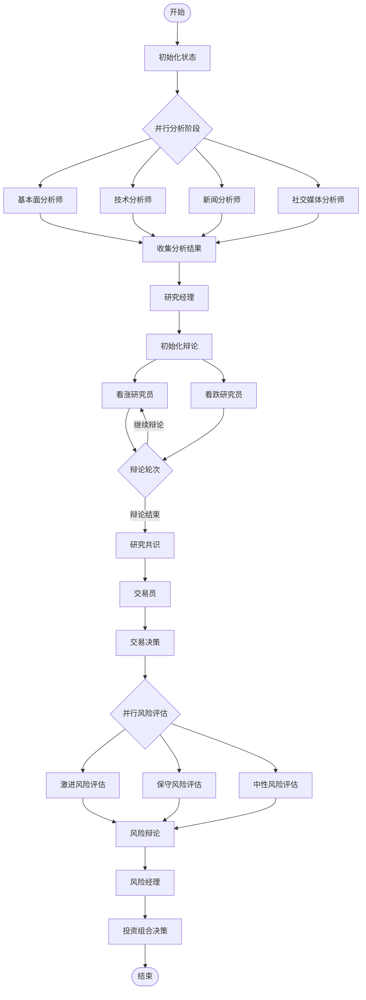

# LangGraph 图结构设计

## 概述

TradingAgents 基于 LangGraph 框架构建，采用有向无环图（DAG）结构来组织智能体的工作流程。这种设计确保了智能体之间的有序协作和信息的正确流转。

## 图结构架构

### 整体工作流图



## 核心组件设计

### 1. 图构建器 (GraphSetup)

```python
class GraphSetup:
    """LangGraph 图结构设置"""
    
    def build_graph(self) -> StateGraph:
        """构建完整的交易决策图"""
        
        # 创建状态图
        workflow = StateGraph(AgentState)
        
        # 添加节点
        self._add_analysis_nodes(workflow)
        self._add_research_nodes(workflow)
        self._add_trading_nodes(workflow)
        self._add_risk_nodes(workflow)
        
        # 添加边和条件逻辑
        self._add_edges(workflow)
        self._add_conditional_edges(workflow)
        
        # 设置入口和出口
        workflow.set_entry_point("initialize")
        workflow.set_finish_point("portfolio_decision")
        
        return workflow.compile()
    
    def _add_analysis_nodes(self, workflow: StateGraph):
        """添加分析师节点"""
        workflow.add_node("fundamentals_analyst", self.fundamentals_analyst)
        workflow.add_node("technical_analyst", self.technical_analyst)
        workflow.add_node("news_analyst", self.news_analyst)
        workflow.add_node("social_analyst", self.social_analyst)
    
    def _add_research_nodes(self, workflow: StateGraph):
        """添加研究员节点"""
        workflow.add_node("research_manager", self.research_manager)
        workflow.add_node("bull_researcher", self.bull_researcher)
        workflow.add_node("bear_researcher", self.bear_researcher)
    
    def _add_trading_nodes(self, workflow: StateGraph):
        """添加交易节点"""
        workflow.add_node("trader", self.trader)
    
    def _add_risk_nodes(self, workflow: StateGraph):
        """添加风险管理节点"""
        workflow.add_node("aggressive_risk", self.aggressive_risk)
        workflow.add_node("conservative_risk", self.conservative_risk)
        workflow.add_node("neutral_risk", self.neutral_risk)
        workflow.add_node("risk_manager", self.risk_manager)
```

### 2. 条件逻辑 (ConditionalLogic)

```python
class ConditionalLogic:
    """图的条件逻辑控制"""
    
    def should_continue_debate(self, state: AgentState) -> str:
        """判断是否继续研究员辩论"""
        
        current_round = state.get("debate_round", 0)
        max_rounds = self.config.get("max_debate_rounds", 3)
        
        # 检查辩论轮次
        if current_round >= max_rounds:
            return "end_debate"
        
        # 检查是否达成共识
        if self._has_consensus(state):
            return "end_debate"
        
        # 检查分歧是否足够大
        if self._has_significant_disagreement(state):
            return "continue_debate"
        
        return "end_debate"
    
    def route_to_risk_assessment(self, state: AgentState) -> List[str]:
        """路由到风险评估节点"""
        
        trading_decision = state.get("trader_decision", {})
        risk_level = trading_decision.get("risk_level", "medium")
        
        # 根据风险级别决定评估路径
        if risk_level == "high":
            return ["aggressive_risk", "conservative_risk", "neutral_risk"]
        elif risk_level == "low":
            return ["conservative_risk", "neutral_risk"]
        else:
            return ["neutral_risk"]
    
    def should_approve_trade(self, state: AgentState) -> str:
        """判断是否批准交易"""
        
        risk_assessment = state.get("risk_assessment", {})
        risk_score = risk_assessment.get("overall_risk_score", 0.5)
        
        # 风险阈值检查
        if risk_score > self.config.get("risk_threshold", 0.8):
            return "reject_trade"
        
        # 一致性检查
        if self._risk_assessments_consistent(state):
            return "approve_trade"
        
        return "request_review"
```

### 3. 状态传播 (Propagator)

```python
class Propagator:
    """状态传播管理器"""
    
    def propagate(self, symbol: str, date: str) -> Tuple[AgentState, Dict]:
        """执行完整的传播流程"""
        
        # 初始化状态
        initial_state = self._initialize_state(symbol, date)
        
        # 执行图传播
        final_state = self.graph.invoke(initial_state)
        
        # 提取决策结果
        decision = self._extract_decision(final_state)
        
        return final_state, decision
    
    def _initialize_state(self, symbol: str, date: str) -> AgentState:
        """初始化智能体状态"""
        return AgentState(
            ticker=symbol,
            date=date,
            analyst_reports={},
            research_reports={},
            trader_decision={},
            risk_assessment={},
            portfolio_decision={},
            messages=[],
            metadata={}
        )
    
    def _extract_decision(self, state: AgentState) -> Dict:
        """从最终状态提取决策信息"""
        return {
            "action": state.portfolio_decision.get("action", "hold"),
            "quantity": state.portfolio_decision.get("quantity", 0),
            "confidence": state.portfolio_decision.get("confidence", 0.5),
            "reasoning": state.portfolio_decision.get("reasoning", ""),
            "risk_score": state.risk_assessment.get("overall_risk_score", 0.5)
        }
```

## 节点类型详解

### 1. 分析节点 (Analysis Nodes)
```python
def fundamentals_analyst_node(state: AgentState) -> AgentState:
    """基本面分析师节点"""
    
    # 获取数据
    data = get_fundamental_data(state.ticker, state.date)
    
    # 执行分析
    analysis = fundamentals_analyst.analyze(data)
    
    # 更新状态
    state.analyst_reports["fundamentals"] = analysis
    
    return state
```

### 2. 决策节点 (Decision Nodes)
```python
def trader_node(state: AgentState) -> AgentState:
    """交易员决策节点"""
    
    # 收集所有分析报告
    all_reports = {
        **state.analyst_reports,
        **state.research_reports
    }
    
    # 制定交易决策
    decision = trader.make_decision(all_reports)
    
    # 更新状态
    state.trader_decision = decision
    
    return state
```

### 3. 并行节点 (Parallel Nodes)
```python
def parallel_analysis_node(state: AgentState) -> AgentState:
    """并行分析节点"""
    
    # 并行执行多个分析师
    with ThreadPoolExecutor() as executor:
        futures = {
            executor.submit(fundamentals_analyst.analyze, state): "fundamentals",
            executor.submit(technical_analyst.analyze, state): "technical",
            executor.submit(news_analyst.analyze, state): "news",
            executor.submit(social_analyst.analyze, state): "social"
        }
        
        # 收集结果
        for future in as_completed(futures):
            analyst_type = futures[future]
            result = future.result()
            state.analyst_reports[analyst_type] = result
    
    return state
```

## 边和路由设计

### 1. 顺序边 (Sequential Edges)
```python
# 简单的顺序连接
workflow.add_edge("initialize", "parallel_analysis")
workflow.add_edge("parallel_analysis", "research_manager")
workflow.add_edge("research_manager", "trader")
```

### 2. 条件边 (Conditional Edges)
```python
# 基于条件的路由
workflow.add_conditional_edges(
    "debate_round",
    conditional_logic.should_continue_debate,
    {
        "continue_debate": "bull_researcher",
        "end_debate": "research_consensus"
    }
)
```

### 3. 并行边 (Parallel Edges)
```python
# 并行执行多个节点
workflow.add_conditional_edges(
    "trading_decision",
    conditional_logic.route_to_risk_assessment,
    {
        "aggressive_risk": "aggressive_risk_node",
        "conservative_risk": "conservative_risk_node",
        "neutral_risk": "neutral_risk_node"
    }
)
```

## 状态管理

### 1. 状态结构
```python
@dataclass
class AgentState:
    """智能体状态数据结构"""
    
    # 基本信息
    ticker: str
    date: str
    
    # 分析结果
    analyst_reports: Dict[str, Any]
    research_reports: Dict[str, Any]
    
    # 决策信息
    trader_decision: Dict[str, Any]
    risk_assessment: Dict[str, Any]
    portfolio_decision: Dict[str, Any]
    
    # 通信记录
    messages: List[BaseMessage]
    
    # 元数据
    metadata: Dict[str, Any]
    
    # 控制信息
    debate_round: int = 0
    risk_round: int = 0
```

### 2. 状态更新
```python
class StateManager:
    """状态管理器"""
    
    def update_state(self, state: AgentState, updates: Dict) -> AgentState:
        """安全地更新状态"""
        
        # 深拷贝状态
        new_state = copy.deepcopy(state)
        
        # 应用更新
        for key, value in updates.items():
            if hasattr(new_state, key):
                setattr(new_state, key, value)
        
        # 验证状态一致性
        self._validate_state(new_state)
        
        return new_state
    
    def _validate_state(self, state: AgentState):
        """验证状态一致性"""
        
        # 检查必需字段
        required_fields = ["ticker", "date"]
        for field in required_fields:
            if not getattr(state, field):
                raise ValueError(f"Required field {field} is missing")
        
        # 检查数据类型
        if not isinstance(state.analyst_reports, dict):
            raise TypeError("analyst_reports must be a dictionary")
```

## 错误处理和恢复

### 1. 节点级错误处理
```python
def safe_node_execution(node_func):
    """节点执行的安全包装器"""
    
    def wrapper(state: AgentState) -> AgentState:
        try:
            return node_func(state)
        except Exception as e:
            # 记录错误
            logger.error(f"Node {node_func.__name__} failed: {e}")
            
            # 添加错误信息到状态
            state.metadata["errors"] = state.metadata.get("errors", [])
            state.metadata["errors"].append({
                "node": node_func.__name__,
                "error": str(e),
                "timestamp": datetime.now().isoformat()
            })
            
            return state
    
    return wrapper
```

### 2. 图级错误恢复
```python
class GraphRecovery:
    """图执行恢复机制"""
    
    def execute_with_recovery(self, graph, initial_state):
        """带恢复机制的图执行"""
        
        try:
            return graph.invoke(initial_state)
        except Exception as e:
            # 尝试从检查点恢复
            if checkpoint := self._find_last_checkpoint(initial_state):
                logger.info("Recovering from checkpoint")
                return self._recover_from_checkpoint(graph, checkpoint)
            
            # 降级执行
            logger.warning("Falling back to degraded execution")
            return self._degraded_execution(initial_state)
```

这种图结构设计确保了智能体工作流的清晰性、可维护性和容错性，同时提供了灵活的扩展机制。
