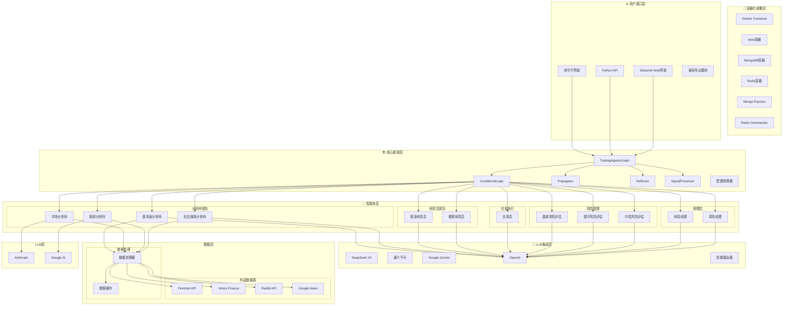
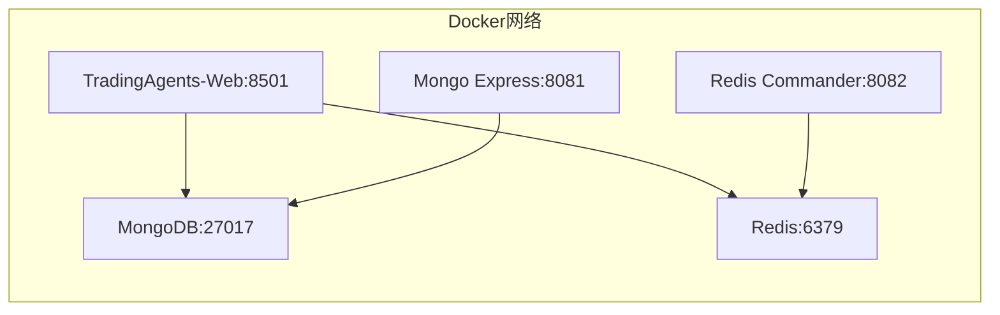
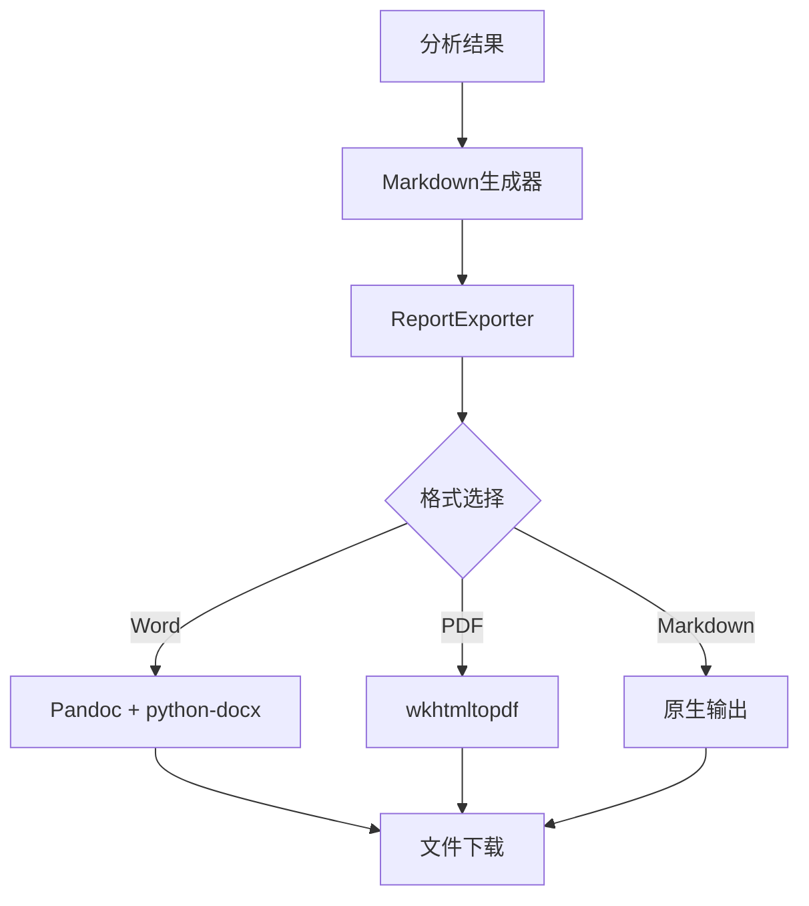
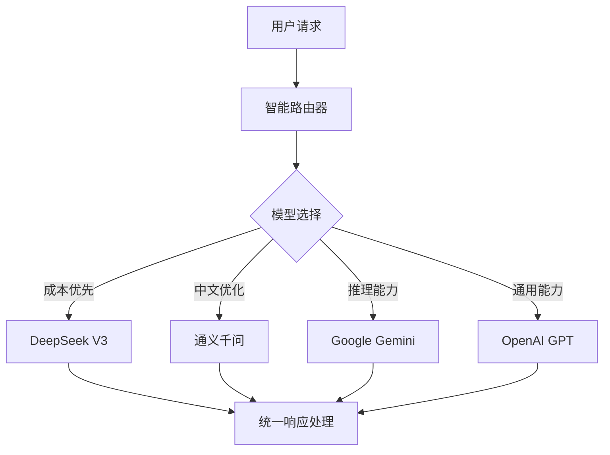

# TradingAgents-CN 系统架构 (v0.1.7)

## 概述

TradingAgents-CN 是一个基于多智能体的金融交易框架，采用现代化容器化分层架构设计，模拟真实世界交易公司的运作模式。系统通过多个专业化的AI智能体协作，实现从市场分析到专业报告导出的完整流程。

## 🎯 v0.1.7 架构亮点

- 🐳 **容器化部署**: Docker Compose多服务编排
- 📄 **报告导出**: 专业级多格式报告生成
- 🧠 **多LLM支持**: DeepSeek V3、通义千问、Gemini集成
- 🗄️ **数据库集成**: MongoDB持久化 + Redis缓存
- 🌐 **Web界面**: Streamlit现代化用户界面

## 整体架构图 (v0.1.7)

## 架构层次

### 1. 用户接口层
- **命令行界面 (CLI)**: 提供交互式命令行工具
- **Python API**: 程序化接口，支持集成到其他系统
- **Web界面**: 基于Chainlit的Web用户界面

### 2. 核心框架层
- **TradingAgentsGraph**: 主要的编排类，管理整个交易流程
- **ConditionalLogic**: 条件逻辑处理，控制智能体间的交互流程
- **Propagator**: 信息传播机制，管理智能体间的信息流
- **Reflector**: 反思机制，支持从历史决策中学习
- **SignalProcessor**: 信号处理，整合各智能体的输出

### 3. 智能体层
采用专业化分工的多智能体架构：

#### 分析师团队
- **基本面分析师**: 分析公司财务数据和基本面指标
- **市场分析师**: 分析技术指标和市场趋势
- **新闻分析师**: 处理新闻事件和宏观经济数据
- **社交媒体分析师**: 分析社交媒体情绪和舆论

#### 研究员团队
- **看涨研究员**: 从乐观角度评估投资机会
- **看跌研究员**: 从悲观角度评估投资风险

#### 交易执行
- **交易员**: 综合各方信息做出最终交易决策

#### 风险管理
- **激进风险评估**: 评估高风险高收益策略
- **保守风险评估**: 评估低风险稳健策略
- **中性风险评估**: 平衡风险收益的中性评估

#### 管理层
- **研究经理**: 协调研究员团队的工作
- **风险经理**: 管理整体风险控制流程

### 4. 数据层
#### 外部数据源
- **FinnHub API**: 实时金融数据
- **Yahoo Finance**: 历史价格和财务数据
- **Reddit API**: 社交媒体情绪数据
- **Google News**: 新闻和事件数据

#### 数据处理
- **数据缓存**: 本地缓存机制，提高性能
- **数据处理器**: 统一的数据处理接口

### 5. LLM层
支持多种大语言模型提供商：
- **OpenAI**: GPT系列模型
- **Anthropic**: Claude系列模型
- **Google AI**: Gemini系列模型

## 核心设计原则

### 1. 模块化设计
- 每个智能体都是独立的模块
- 支持插件式扩展
- 松耦合的组件设计

### 2. 可扩展性
- 支持添加新的智能体类型
- 支持新的数据源集成
- 支持新的LLM提供商

### 3. 容错性
- 智能体故障隔离
- 数据源故障转移
- 优雅的错误处理

### 4. 性能优化
- 数据缓存机制
- 并行处理能力
- 智能的API调用管理

## 数据流向

1. **数据获取**: 从多个外部数据源获取实时和历史数据
2. **数据处理**: 清洗、标准化和缓存数据
3. **智能体分析**: 各专业智能体并行分析数据
4. **信息整合**: 整合各智能体的分析结果
5. **决策制定**: 通过辩论和协商机制形成最终决策
6. **风险评估**: 风险管理团队评估决策风险
7. **交易执行**: 执行最终的交易决策

## 技术栈

- **框架**: LangGraph (基于LangChain)
- **编程语言**: Python 3.10+
- **数据处理**: Pandas, NumPy
- **API集成**: requests, finnhub-python, yfinance
- **缓存**: Redis (可选)
- **UI**: Chainlit, Rich (CLI)
- **配置管理**: YAML/JSON配置文件

这种架构设计确保了系统的可扩展性、可维护性和高性能，同时保持了各组件间的清晰职责分工。

## 🐳 容器化架构 (v0.1.7新增)

### Docker Compose服务编排

### 容器化优势

1. **🚀 快速部署**
   - 一键启动完整环境
   - 自动依赖管理
   - 环境一致性保证

2. **🔧 开发友好**
   - Volume映射实时同步
   - 热重载支持
   - 调试工具集成

3. **📊 监控管理**
   - 数据库可视化管理
   - 缓存状态监控
   - 服务健康检查

## 📄 报告导出架构 (v0.1.7新增)

### 导出流程架构

### 技术实现

1. **📝 内容生成**
   - 结构化Markdown模板
   - 动态数据填充
   - 格式化处理

2. **🔄 格式转换**
   - Pandoc通用转换引擎
   - 专业排版优化
   - 中文字体支持

3. **📁 文件管理**
   - 临时文件处理
   - 自动清理机制
   - 下载链接生成

## 🧠 LLM集成架构 (v0.1.7扩展)

### 多模型支持架构

### LLM提供商特性

| 提供商 | 模型 | 特色 | 适用场景 |
|-------|------|------|----------|
| **🇨🇳 DeepSeek** | V3 | 成本低，工具调用强 | 数据分析，计算任务 |
| **🇨🇳 阿里百炼** | 通义千问 | 中文理解好 | 中文内容分析 |
| **🌍 Google AI** | Gemini | 推理能力强 | 复杂逻辑分析 |
| **🤖 OpenAI** | GPT-4 | 通用能力强 | 综合分析任务 |

## 🔮 架构演进规划

### 短期目标 (v0.1.8)
- 🔄 微服务架构重构
- 📊 实时数据流处理
- 🛡️ 安全性增强

### 中期目标 (v0.2.x)
- ☁️ 云原生部署支持
- 📱 移动端适配
- 🌐 多语言国际化

### 长期目标 (v1.0+)
- 🤖 AI模型自训练
- 📈 量化交易集成
- 🏢 企业级功能

---

*最后更新: 2025-07-13*
*版本: cn-0.1.7*
