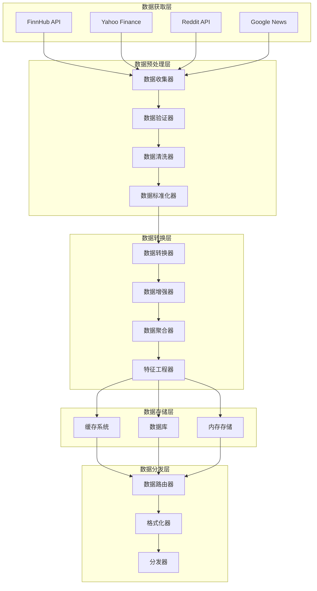

# 数据处理流程

## 概述

TradingAgents 框架的数据处理系统负责将来自多个数据源的原始数据转换为智能体可以使用的标准化、高质量信息。本文档详细介绍了数据获取、清洗、转换、验证和分发的完整流程。

## 数据处理架构

### 数据处理管道



## 1. 数据收集器

### 核心功能
```python
class DataCollector:
    """数据收集器 - 统一收集各数据源的数据"""
    
    def __init__(self, config: Dict):
        self.config = config
        self.data_sources = self._initialize_data_sources()
        self.collection_scheduler = CollectionScheduler()
        self.error_handler = DataErrorHandler()
        
    def collect_comprehensive_data(self, symbol: str, date: str = None) -> Dict:
        """收集综合数据"""
        
        collection_tasks = {
            "price_data": self._collect_price_data,
            "fundamental_data": self._collect_fundamental_data,
            "technical_data": self._collect_technical_data,
            "news_data": self._collect_news_data,
            "social_data": self._collect_social_data,
            "market_data": self._collect_market_data
        }
        
        collected_data = {}
        collection_metadata = {}
        
        # 并行收集数据
        with ThreadPoolExecutor(max_workers=6) as executor:
            future_to_task = {
                executor.submit(task_func, symbol, date): task_name
                for task_name, task_func in collection_tasks.items()
            }
            
            for future in as_completed(future_to_task):
                task_name = future_to_task[future]
                try:
                    result = future.result(timeout=30)  # 30秒超时
                    collected_data[task_name] = result["data"]
                    collection_metadata[task_name] = result["metadata"]
                except Exception as e:
                    self.error_handler.handle_collection_error(task_name, e)
                    collected_data[task_name] = {}
                    collection_metadata[task_name] = {"error": str(e)}
        
        return {
            "data": collected_data,
            "metadata": collection_metadata,
            "collection_timestamp": datetime.now().isoformat(),
            "symbol": symbol,
            "date": date
        }
    
    def _collect_price_data(self, symbol: str, date: str = None) -> Dict:
        """收集价格数据"""
        
        price_sources = ["finnhub", "yahoo_finance"]
        price_data = {}
        
        for source in price_sources:
            try:
                if source == "finnhub" and "finnhub" in self.data_sources:
                    data = self.data_sources["finnhub"].get_stock_price(symbol)
                    price_data["finnhub"] = data
                    break  # 优先使用 FinnHub
                elif source == "yahoo_finance":
                    data = self.data_sources["yahoo"].get_current_price(symbol)
                    price_data["yahoo"] = data
            except Exception as e:
                print(f"Error collecting price data from {source}: {e}")
        
        # 选择最佳数据源
        best_price_data = self._select_best_price_data(price_data)
        
        return {
            "data": best_price_data,
            "metadata": {
                "sources_attempted": price_sources,
                "sources_successful": list(price_data.keys()),
                "primary_source": self._identify_primary_source(price_data)
            }
        }
    
    def _collect_fundamental_data(self, symbol: str, date: str = None) -> Dict:
        """收集基本面数据"""
        
        fundamental_data = {}
        
        # 财务报表数据
        try:
            if "finnhub" in self.data_sources:
                financials = self.data_sources["finnhub"].get_financial_statements(symbol)
                fundamental_data["financials"] = financials
        except Exception as e:
            print(f"Error collecting financial statements: {e}")
        
        # 公司概况
        try:
            if "finnhub" in self.data_sources:
                profile = self.data_sources["finnhub"].get_company_profile(symbol)
                fundamental_data["profile"] = profile
        except Exception as e:
            print(f"Error collecting company profile: {e}")
        
        # 估值指标
        try:
            if "yahoo" in self.data_sources:
                valuation = self.data_sources["yahoo"].get_valuation_metrics(symbol)
                fundamental_data["valuation"] = valuation
        except Exception as e:
            print(f"Error collecting valuation metrics: {e}")
        
        return {
            "data": fundamental_data,
            "metadata": {
                "data_completeness": self._assess_fundamental_completeness(fundamental_data),
                "data_freshness": self._assess_data_freshness(fundamental_data)
            }
        }
```

## 2. 数据验证器

### 数据质量检查
```python
class DataValidator:
    """数据验证器 - 确保数据质量和完整性"""
    
    def __init__(self):
        self.validation_rules = self._load_validation_rules()
        self.quality_metrics = QualityMetrics()
        
    def validate_collected_data(self, collected_data: Dict) -> Dict:
        """验证收集的数据"""
        
        validation_results = {}
        
        for data_type, data in collected_data["data"].items():
            validation_result = self._validate_data_type(data_type, data)
            validation_results[data_type] = validation_result
        
        # 计算整体数据质量评分
        overall_quality = self._calculate_overall_quality(validation_results)
        
        return {
            "validation_results": validation_results,
            "overall_quality": overall_quality,
            "quality_grade": self._assign_quality_grade(overall_quality),
            "issues_found": self._extract_issues(validation_results),
            "recommendations": self._generate_quality_recommendations(validation_results)
        }
    
    def _validate_data_type(self, data_type: str, data: Dict) -> Dict:
        """验证特定类型的数据"""
        
        validation_checks = {
            "completeness": self._check_completeness(data_type, data),
            "accuracy": self._check_accuracy(data_type, data),
            "consistency": self._check_consistency(data_type, data),
            "timeliness": self._check_timeliness(data_type, data),
            "format": self._check_format(data_type, data)
        }
        
        # 计算验证评分
        validation_score = sum(check["score"] for check in validation_checks.values()) / len(validation_checks)
        
        return {
            "checks": validation_checks,
            "validation_score": validation_score,
            "status": "passed" if validation_score > 0.8 else "warning" if validation_score > 0.6 else "failed",
            "critical_issues": [check["issue"] for check in validation_checks.values() if check.get("critical")]
        }
    
    def _check_completeness(self, data_type: str, data: Dict) -> Dict:
        """检查数据完整性"""
        
        required_fields = self.validation_rules[data_type]["required_fields"]
        missing_fields = [field for field in required_fields if field not in data]
        
        completeness_score = 1.0 - (len(missing_fields) / len(required_fields))
        
        return {
            "score": completeness_score,
            "missing_fields": missing_fields,
            "critical": len(missing_fields) > len(required_fields) * 0.5,
            "issue": f"Missing {len(missing_fields)} required fields" if missing_fields else None
        }
    
    def _check_accuracy(self, data_type: str, data: Dict) -> Dict:
        """检查数据准确性"""
        
        accuracy_issues = []
        
        if data_type == "price_data":
            # 价格合理性检查
            if "current_price" in data:
                price = data["current_price"]
                if not isinstance(price, (int, float)) or price <= 0:
                    accuracy_issues.append("Invalid price value")
                elif price > 10000:  # 异常高价格
                    accuracy_issues.append("Unusually high price")
        
        elif data_type == "fundamental_data":
            # 财务数据合理性检查
            if "market_cap" in data:
                market_cap = data["market_cap"]
                if market_cap and market_cap < 0:
                    accuracy_issues.append("Negative market cap")
        
        accuracy_score = 1.0 if not accuracy_issues else 0.5
        
        return {
            "score": accuracy_score,
            "issues": accuracy_issues,
            "critical": len(accuracy_issues) > 0,
            "issue": "; ".join(accuracy_issues) if accuracy_issues else None
        }
```

## 3. 数据清洗器

### 数据清洗流程
```python
class DataCleaner:
    """数据清洗器 - 清理和修复数据问题"""
    
    def __init__(self):
        self.cleaning_strategies = self._initialize_cleaning_strategies()
        self.outlier_detector = OutlierDetector()
        
    def clean_data(self, validated_data: Dict) -> Dict:
        """清洗数据"""
        
        cleaned_data = {}
        cleaning_log = {}
        
        for data_type, data in validated_data["data"].items():
            cleaning_result = self._clean_data_type(data_type, data)
            cleaned_data[data_type] = cleaning_result["cleaned_data"]
            cleaning_log[data_type] = cleaning_result["cleaning_log"]
        
        return {
            "cleaned_data": cleaned_data,
            "cleaning_log": cleaning_log,
            "cleaning_summary": self._generate_cleaning_summary(cleaning_log)
        }
    
    def _clean_data_type(self, data_type: str, data: Dict) -> Dict:
        """清洗特定类型的数据"""
        
        cleaned_data = data.copy()
        cleaning_operations = []
        
        # 处理缺失值
        missing_value_result = self._handle_missing_values(data_type, cleaned_data)
        cleaned_data.update(missing_value_result["data"])
        cleaning_operations.extend(missing_value_result["operations"])
        
        # 处理异常值
        outlier_result = self._handle_outliers(data_type, cleaned_data)
        cleaned_data.update(outlier_result["data"])
        cleaning_operations.extend(outlier_result["operations"])
        
        # 数据类型转换
        type_conversion_result = self._convert_data_types(data_type, cleaned_data)
        cleaned_data.update(type_conversion_result["data"])
        cleaning_operations.extend(type_conversion_result["operations"])
        
        # 数据格式标准化
        standardization_result = self._standardize_formats(data_type, cleaned_data)
        cleaned_data.update(standardization_result["data"])
        cleaning_operations.extend(standardization_result["operations"])
        
        return {
            "cleaned_data": cleaned_data,
            "cleaning_log": {
                "operations": cleaning_operations,
                "data_quality_improvement": self._measure_quality_improvement(data, cleaned_data)
            }
        }
    
    def _handle_missing_values(self, data_type: str, data: Dict) -> Dict:
        """处理缺失值"""
        
        operations = []
        updated_data = {}
        
        if data_type == "price_data":
            # 价格数据的缺失值处理
            if "current_price" not in data or data["current_price"] is None:
                # 尝试从历史数据推断
                if "previous_close" in data and data["previous_close"]:
                    updated_data["current_price"] = data["previous_close"]
                    operations.append("Imputed current_price from previous_close")
        
        elif data_type == "fundamental_data":
            # 基本面数据的缺失值处理
            if "market_cap" not in data or data["market_cap"] is None:
                # 尝试计算市值
                if "shares_outstanding" in data and "current_price" in data:
                    if data["shares_outstanding"] and data["current_price"]:
                        updated_data["market_cap"] = data["shares_outstanding"] * data["current_price"]
                        operations.append("Calculated market_cap from shares and price")
        
        return {
            "data": updated_data,
            "operations": operations
        }
    
    def _handle_outliers(self, data_type: str, data: Dict) -> Dict:
        """处理异常值"""
        
        operations = []
        updated_data = {}
        
        if data_type == "price_data":
            # 检查价格异常值
            if "current_price" in data:
                price = data["current_price"]
                if isinstance(price, (int, float)):
                    # 使用历史价格范围检查异常值
                    if self._is_price_outlier(price, data):
                        # 使用前一交易日收盘价替代
                        if "previous_close" in data:
                            updated_data["current_price"] = data["previous_close"]
                            operations.append(f"Replaced outlier price {price} with previous_close")
        
        return {
            "data": updated_data,
            "operations": operations
        }
```

## 4. 数据转换器

### 数据标准化和转换
```python
class DataTransformer:
    """数据转换器 - 标准化和转换数据格式"""
    
    def __init__(self):
        self.transformation_rules = self._load_transformation_rules()
        self.unit_converter = UnitConverter()
        
    def transform_data(self, cleaned_data: Dict) -> Dict:
        """转换数据"""
        
        transformed_data = {}
        transformation_log = {}
        
        for data_type, data in cleaned_data["cleaned_data"].items():
            transformation_result = self._transform_data_type(data_type, data)
            transformed_data[data_type] = transformation_result["transformed_data"]
            transformation_log[data_type] = transformation_result["transformation_log"]
        
        return {
            "transformed_data": transformed_data,
            "transformation_log": transformation_log,
            "transformation_summary": self._generate_transformation_summary(transformation_log)
        }
    
    def _transform_data_type(self, data_type: str, data: Dict) -> Dict:
        """转换特定类型的数据"""
        
        transformed_data = {}
        transformations = []
        
        if data_type == "price_data":
            transformed_data = self._transform_price_data(data)
            transformations.append("Price data standardization")
            
        elif data_type == "fundamental_data":
            transformed_data = self._transform_fundamental_data(data)
            transformations.append("Fundamental data normalization")
            
        elif data_type == "news_data":
            transformed_data = self._transform_news_data(data)
            transformations.append("News data processing")
            
        elif data_type == "social_data":
            transformed_data = self._transform_social_data(data)
            transformations.append("Social data analysis")
        
        return {
            "transformed_data": transformed_data,
            "transformation_log": {
                "transformations": transformations,
                "data_schema": self._generate_data_schema(transformed_data)
            }
        }
    
    def _transform_price_data(self, data: Dict) -> Dict:
        """转换价格数据"""
        
        transformed = {
            "symbol": data.get("symbol"),
            "price": {
                "current": float(data.get("current_price", 0)),
                "open": float(data.get("open", 0)),
                "high": float(data.get("high", 0)),
                "low": float(data.get("low", 0)),
                "previous_close": float(data.get("previous_close", 0))
            },
            "change": {
                "absolute": float(data.get("change", 0)),
                "percentage": float(data.get("change_percent", 0))
            },
            "volume": int(data.get("volume", 0)),
            "timestamp": self._standardize_timestamp(data.get("timestamp"))
        }
        
        # 计算额外指标
        if transformed["price"]["current"] and transformed["price"]["previous_close"]:
            transformed["metrics"] = {
                "daily_return": (transformed["price"]["current"] - transformed["price"]["previous_close"]) / transformed["price"]["previous_close"],
                "volatility_indicator": abs(transformed["price"]["high"] - transformed["price"]["low"]) / transformed["price"]["current"] if transformed["price"]["current"] else 0
            }
        
        return transformed
    
    def _transform_fundamental_data(self, data: Dict) -> Dict:
        """转换基本面数据"""
        
        transformed = {
            "company_info": {
                "symbol": data.get("symbol"),
                "name": data.get("name"),
                "sector": data.get("sector"),
                "industry": data.get("industry"),
                "market_cap": self._normalize_market_cap(data.get("market_cap"))
            },
            "valuation_metrics": {
                "pe_ratio": float(data.get("pe_ratio", 0)) if data.get("pe_ratio") else None,
                "pb_ratio": float(data.get("pb_ratio", 0)) if data.get("pb_ratio") else None,
                "ps_ratio": float(data.get("ps_ratio", 0)) if data.get("ps_ratio") else None,
                "ev_ebitda": float(data.get("ev_ebitda", 0)) if data.get("ev_ebitda") else None
            },
            "financial_health": {
                "debt_to_equity": float(data.get("debt_to_equity", 0)) if data.get("debt_to_equity") else None,
                "current_ratio": float(data.get("current_ratio", 0)) if data.get("current_ratio") else None,
                "roe": float(data.get("roe", 0)) if data.get("roe") else None,
                "roa": float(data.get("roa", 0)) if data.get("roa") else None
            },
            "growth_metrics": {
                "revenue_growth": float(data.get("revenue_growth", 0)) if data.get("revenue_growth") else None,
                "earnings_growth": float(data.get("earnings_growth", 0)) if data.get("earnings_growth") else None,
                "book_value_growth": float(data.get("book_value_growth", 0)) if data.get("book_value_growth") else None
            }
        }
        
        return transformed
```

## 5. 特征工程器

### 特征提取和生成
```python
class FeatureEngineer:
    """特征工程器 - 生成分析特征"""
    
    def __init__(self):
        self.feature_generators = self._initialize_feature_generators()
        
    def engineer_features(self, transformed_data: Dict) -> Dict:
        """工程化特征"""
        
        features = {}
        
        # 价格特征
        if "price_data" in transformed_data:
            features["price_features"] = self._generate_price_features(transformed_data["price_data"])
        
        # 基本面特征
        if "fundamental_data" in transformed_data:
            features["fundamental_features"] = self._generate_fundamental_features(transformed_data["fundamental_data"])
        
        # 技术特征
        if "technical_data" in transformed_data:
            features["technical_features"] = self._generate_technical_features(transformed_data["technical_data"])
        
        # 情感特征
        sentiment_data = {}
        if "news_data" in transformed_data:
            sentiment_data["news"] = transformed_data["news_data"]
        if "social_data" in transformed_data:
            sentiment_data["social"] = transformed_data["social_data"]
        
        if sentiment_data:
            features["sentiment_features"] = self._generate_sentiment_features(sentiment_data)
        
        # 综合特征
        features["composite_features"] = self._generate_composite_features(features)
        
        return {
            "features": features,
            "feature_metadata": self._generate_feature_metadata(features)
        }
    
    def _generate_price_features(self, price_data: Dict) -> Dict:
        """生成价格特征"""
        
        price_info = price_data.get("price", {})
        
        features = {
            "price_momentum": self._calculate_price_momentum(price_info),
            "price_volatility": self._calculate_price_volatility(price_info),
            "price_trend": self._identify_price_trend(price_info),
            "support_resistance": self._identify_support_resistance(price_info),
            "volume_profile": self._analyze_volume_profile(price_data.get("volume", 0))
        }
        
        return features
    
    def _generate_fundamental_features(self, fundamental_data: Dict) -> Dict:
        """生成基本面特征"""
        
        valuation = fundamental_data.get("valuation_metrics", {})
        health = fundamental_data.get("financial_health", {})
        growth = fundamental_data.get("growth_metrics", {})
        
        features = {
            "valuation_score": self._calculate_valuation_score(valuation),
            "financial_strength": self._calculate_financial_strength(health),
            "growth_quality": self._assess_growth_quality(growth),
            "profitability_trend": self._analyze_profitability_trend(fundamental_data),
            "competitive_position": self._assess_competitive_position(fundamental_data)
        }
        
        return features
```

## 6. 数据分发器

### 智能数据路由
```python
class DataDispatcher:
    """数据分发器 - 将处理后的数据分发给智能体"""
    
    def __init__(self):
        self.routing_rules = self._load_routing_rules()
        self.agent_requirements = self._load_agent_requirements()
        
    def dispatch_data(self, engineered_data: Dict, target_agents: List[str]) -> Dict:
        """分发数据给目标智能体"""
        
        dispatched_data = {}
        
        for agent in target_agents:
            agent_data = self._prepare_agent_data(agent, engineered_data)
            dispatched_data[agent] = agent_data
        
        return {
            "agent_data": dispatched_data,
            "dispatch_metadata": {
                "target_agents": target_agents,
                "dispatch_timestamp": datetime.now().isoformat(),
                "data_completeness": self._assess_dispatch_completeness(dispatched_data)
            }
        }
    
    def _prepare_agent_data(self, agent: str, data: Dict) -> Dict:
        """为特定智能体准备数据"""
        
        agent_requirements = self.agent_requirements.get(agent, {})
        required_features = agent_requirements.get("required_features", [])
        
        agent_data = {}
        
        # 根据智能体需求筛选数据
        for feature_category in required_features:
            if feature_category in data["features"]:
                agent_data[feature_category] = data["features"][feature_category]
        
        # 添加智能体特定的数据格式化
        formatted_data = self._format_for_agent(agent, agent_data)
        
        return {
            "data": formatted_data,
            "metadata": {
                "agent": agent,
                "data_version": data.get("feature_metadata", {}).get("version"),
                "completeness_score": self._calculate_completeness_score(agent_data, required_features)
            }
        }
```

通过这个完整的数据处理流程，TradingAgents 确保智能体获得高质量、标准化、相关的数据，为准确的分析和决策提供坚实基础。
