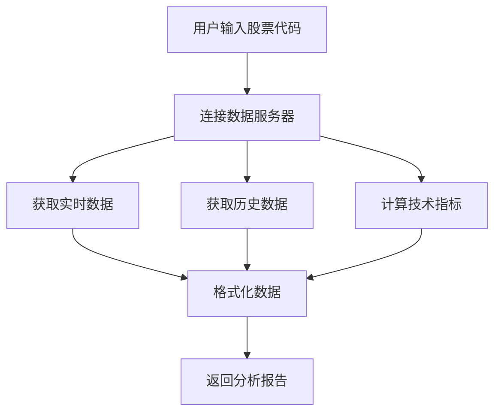

# Tushare数据接口集成指南

## 🎯 概述

Tushare数据接口为TradingAgents-CN提供了高质量的中国股票数据，包括A股、深股、创业板、科创板等所有板块的实时行情和历史数据。

## 🌟 优势对比

### 📊 数据覆盖对比

| 数据类型 | Tushare数据接口 | Yahoo Finance | 优势 |
|----------|-----------|---------------|------|
| **A股实时数据** | ✅ 完整覆盖 | ❌ 不支持 | 🟢 独有优势 |
| **港股数据** | ✅ 实时数据 | ⚠️ 部分支持 | 🟢 更全面 |
| **数据实时性** | ✅ 秒级更新 | ⚠️ 15分钟延迟 | 🟢 实时性强 |
| **技术指标** | ✅ 丰富指标 | ✅ 基础指标 | 🟡 相当 |
| **历史数据** | ✅ 完整历史 | ✅ 完整历史 | 🟡 相当 |
| **中文支持** | ✅ 原生支持 | ❌ 不支持 | 🟢 本土化 |

### 🇨🇳 本土化优势

- **数据源权威**: 直接对接交易所数据
- **更新及时**: 实时行情，无延迟
- **中文支持**: 股票名称、板块分类等
- **本土特色**: 涨跌停、ST股票等特殊标记
- **免费使用**: 无需API密钥，免费获取数据

## 🔧 安装和配置

### 1. 安装依赖

```bash
# 方法1: 使用安装脚本
python install_tdx.py

# 方法2: 手动安装
pip install pytdx
```

### 2. 验证安装

```bash
# 运行测试脚本
python test_tdx_integration.py
```

### 3. 无需额外配置

Tushare数据接口使用免费的公共服务器，无需申请API密钥或进行额外配置。

## 📊 支持的数据类型

### 1. 实时行情数据

```python
# 获取实时数据
realtime_data = {
    'code': '000001',
    'name': '平安银行',
    'price': 12.34,
    'change_percent': 2.15,
    'volume': 1234567,
    'amount': 15234567.89,
    'bid_prices': [12.33, 12.32, 12.31, 12.30, 12.29],
    'ask_prices': [12.34, 12.35, 12.36, 12.37, 12.38],
    'update_time': '2024-01-01 15:00:00'
}
```

### 2. 历史K线数据

```python
# 支持的周期
periods = {
    'D': '日线',
    'W': '周线', 
    'M': '月线'
}

# 数据格式 (兼容Yahoo Finance)
columns = ['Open', 'High', 'Low', 'Close', 'Volume', 'Amount']
```

### 3. 技术指标

```python
# 支持的技术指标
indicators = {
    'MA5': '5日移动平均',
    'MA10': '10日移动平均',
    'MA20': '20日移动平均',
    'RSI': '相对强弱指数',
    'MACD': 'MACD指标',
    'BB_Upper': '布林带上轨',
    'BB_Lower': '布林带下轨'
}
```

### 4. 市场概览

```python
# 主要指数
indices = {
    '上证指数': '000001',
    '深证成指': '399001', 
    '创业板指': '399006',
    '科创50': '000688'
}
```

## 🎯 使用方法

### 1. Web界面使用

1. **启动Web界面**:
   ```bash
   python -m streamlit run web/app.py
   ```

2. **选择A股市场**:
   - 在"选择市场"下拉框中选择"A股"

3. **输入股票代码**:
   ```
   000001  # 平安银行
   600519  # 贵州茅台
   000858  # 五粮液
   300750  # 宁德时代
   ```

4. **开始分析**:
   - 系统将自动使用Tushare数据接口获取实时数据

### 2. 编程接口使用

```python
from tradingagents.dataflows.tdx_utils import get_china_stock_data, get_china_market_overview

# 获取股票数据
stock_data = get_china_stock_data('000001', '2024-01-01', '2024-01-31')
print(stock_data)

# 获取市场概览
market_overview = get_china_market_overview()
print(market_overview)
```

### 3. 在分析师中使用

```python
# 新增的工具函数
toolkit.get_china_stock_data('000001', '2024-01-01', '2024-01-31')
toolkit.get_china_market_overview('2024-01-31')
```

## 📈 支持的股票代码格式

### A股代码规则

| 代码前缀 | 市场 | 示例 | 说明 |
|----------|------|------|------|
| **000xxx** | 深圳主板 | 000001 | 平安银行 |
| **002xxx** | 深圳中小板 | 002415 | 海康威视 |
| **003xxx** | 深圳主板 | 003816 | 中国广核 |
| **300xxx** | 创业板 | 300750 | 宁德时代 |
| **600xxx** | 上海主板 | 600519 | 贵州茅台 |
| **601xxx** | 上海主板 | 601318 | 中国平安 |
| **603xxx** | 上海主板 | 603259 | 药明康德 |
| **688xxx** | 科创板 | 688981 | 中芯国际 |

### 常用股票代码

```python
popular_stocks = {
    # 银行股
    '000001': '平安银行',
    '600036': '招商银行',
    '601398': '工商银行',
    
    # 白酒股
    '600519': '贵州茅台',
    '000858': '五粮液',
    '000568': '泸州老窖',
    
    # 科技股
    '000002': '万科A',
    '000651': '格力电器',
    '300750': '宁德时代',
    
    # 新能源
    '002594': '比亚迪',
    '300274': '阳光电源'
}
```

## 🔍 技术实现细节

### 1. 连接机制

```python
# 使用免费的数据服务器
servers = [
    ('119.147.212.81', 7709),  # 主服务器
    ('119.147.212.81', 7721)   # 扩展服务器
]
```

### 2. 数据获取流程



### 3. 错误处理

```python
# 自动重连机制
if not connected:
    success = connect()
    if not success:
        return fallback_data

# 数据验证
if not data or len(data) == 0:
    return empty_result_with_message
```

## 🚨 注意事项

### 1. 网络要求

- **需要网络连接**: Tushare数据接口需要连接到数据服务器
- **服务器稳定性**: 依赖通达信免费服务器的可用性
- **连接超时**: 网络不稳定时可能出现连接超时

### 2. 数据限制

- **历史数据**: 单次最多获取800条K线数据
- **实时数据**: 交易时间内数据更新频率最高
- **技术指标**: 需要足够的历史数据进行计算

### 3. 使用建议

- **备用方案**: 建议同时配置Yahoo Finance作为备用数据源
- **数据验证**: 重要决策前建议交叉验证数据
- **交易时间**: 非交易时间获取的是最后交易日数据

## 🔧 故障排除

### 常见问题

#### 1. 连接失败

```bash
❌ Tushare数据接口连接失败: [Errno 11001] getaddrinfo failed
```

**解决方案**:
- 检查网络连接
- 尝试重新运行程序
- 检查防火墙设置

#### 2. 数据获取失败

```bash
⚠️ 未获取到股票数据
```

**解决方案**:
- 确认股票代码格式正确
- 检查股票是否存在
- 尝试其他股票代码

#### 3. pytdx安装失败

```bash
❌ pytdx库安装失败
```

**解决方案**:
```bash
# 升级pip
python -m pip install --upgrade pip

# 重新安装
pip install pytdx --no-cache-dir

# 或使用国内镜像
pip install pytdx -i https://pypi.tuna.tsinghua.edu.cn/simple/
```

## 🎯 最佳实践

### 1. 性能优化

```python
# 复用连接
provider = get_tdx_provider()  # 全局实例

# 批量获取数据
stocks = ['000001', '600519', '000858']
for stock in stocks:
    data = provider.get_real_time_data(stock)
```

### 2. 错误处理

```python
try:
    data = get_china_stock_data(stock_code, start_date, end_date)
    if "获取失败" in data:
        # 使用备用数据源
        fallback_data = get_yahoo_finance_data(stock_code)
except Exception as e:
    # 记录错误并提供用户友好的消息
    logger.error(f"数据获取失败: {e}")
    return "数据暂时不可用，请稍后重试"
```

### 3. 数据缓存

```python
# 实现简单的数据缓存
cache = {}
cache_key = f"{stock_code}_{date}"

if cache_key in cache:
    return cache[cache_key]
else:
    data = fetch_data(stock_code, date)
    cache[cache_key] = data
    return data
```

## 📊 性能基准

### 数据获取速度

| 操作 | 平均耗时 | 说明 |
|------|----------|------|
| **连接服务器** | 1-3秒 | 首次连接 |
| **实时数据** | 0.5-1秒 | 单只股票 |
| **历史数据** | 2-5秒 | 30天数据 |
| **技术指标** | 1-2秒 | 基础指标 |
| **市场概览** | 3-5秒 | 主要指数 |

### 数据准确性

- **实时数据**: 与交易所数据一致
- **历史数据**: 复权处理准确
- **技术指标**: 计算方法标准
- **中文名称**: 官方标准名称

## 🎉 总结

Tushare数据接口的集成为TradingAgents-CN带来了以下价值：

1. **🇨🇳 本土化优势**: 完整的A股数据覆盖
2. **⚡ 实时性**: 秒级数据更新
3. **💰 成本优势**: 免费使用，无API限制
4. **🔧 易用性**: 无需复杂配置
5. **📊 专业性**: 丰富的技术指标

现在您可以在TradingAgents-CN中无缝分析中国股票，享受专业级的本土化股票分析体验！
