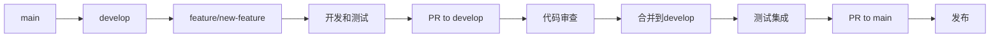
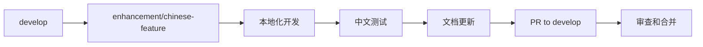
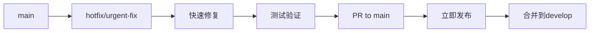

# 分支管理策略

## 🌿 分支架构设计

### 主要分支

```
main (生产分支)
├── develop (开发主分支)
├── feature/* (功能开发分支)
├── enhancement/* (中文增强分支)
├── hotfix/* (紧急修复分支)
├── release/* (发布准备分支)
└── upstream-sync/* (上游同步分支)
```

### 分支说明

#### 🏠 **main** - 生产主分支
- **用途**: 稳定的生产版本
- **保护**: 受保护，只能通过PR合并
- **来源**: develop、hotfix、upstream-sync
- **特点**: 始终保持可发布状态

#### 🚀 **develop** - 开发主分支
- **用途**: 集成所有功能开发
- **保护**: 受保护，通过PR合并
- **来源**: feature、enhancement分支
- **特点**: 最新的开发进度

#### ✨ **feature/** - 功能开发分支
- **命名**: `feature/功能名称`
- **用途**: 开发新功能
- **生命周期**: 短期（1-2周）
- **示例**: `feature/portfolio-optimization`

#### 🇨🇳 **enhancement/** - 中文增强分支
- **命名**: `enhancement/增强名称`
- **用途**: 中文本地化和增强功能
- **生命周期**: 中期（2-4周）
- **示例**: `enhancement/chinese-llm-integration`

#### 🚨 **hotfix/** - 紧急修复分支
- **命名**: `hotfix/修复描述`
- **用途**: 紧急Bug修复
- **生命周期**: 短期（1-3天）
- **示例**: `hotfix/api-timeout-fix`

#### 📦 **release/** - 发布准备分支
- **命名**: `release/版本号`
- **用途**: 发布前的最后准备
- **生命周期**: 短期（3-7天）
- **示例**: `release/v1.1.0-cn`

#### 🔄 **upstream-sync/** - 上游同步分支
- **命名**: `upstream-sync/日期`
- **用途**: 同步上游更新
- **生命周期**: 临时（1天）
- **示例**: `upstream-sync/20240115`

## 🔄 工作流程

### 功能开发流程



### 中文增强流程



### 紧急修复流程



## 📋 分支操作指南

### 创建功能分支

```bash
# 从develop创建功能分支
git checkout develop
git pull origin develop
git checkout -b feature/portfolio-analysis

# 开发完成后推送
git push -u origin feature/portfolio-analysis
```

### 创建中文增强分支

```bash
# 从develop创建增强分支
git checkout develop
git pull origin develop
git checkout -b enhancement/tushare-integration

# 推送分支
git push -u origin enhancement/tushare-integration
```

### 创建紧急修复分支

```bash
# 从main创建修复分支
git checkout main
git pull origin main
git checkout -b hotfix/api-error-fix

# 推送分支
git push -u origin hotfix/api-error-fix
```

## 🔒 分支保护规则

### main分支保护
- ✅ 要求PR审查
- ✅ 要求状态检查通过
- ✅ 要求分支为最新
- ✅ 限制推送权限
- ✅ 限制强制推送

### develop分支保护
- ✅ 要求PR审查
- ✅ 要求CI通过
- ✅ 允许管理员绕过

### 功能分支
- ❌ 无特殊保护
- ✅ 自动删除已合并分支

## 🏷️ 命名规范

### 分支命名

```bash
# 功能开发
feature/功能名称-简短描述
feature/chinese-data-source
feature/risk-management-enhancement

# 中文增强
enhancement/增强类型-具体内容
enhancement/llm-baidu-integration
enhancement/chinese-financial-terms

# Bug修复
hotfix/问题描述
hotfix/memory-leak-fix
hotfix/config-loading-error

# 发布准备
release/版本号
release/v1.1.0-cn
release/v1.2.0-cn-beta
```

### 提交信息规范

```bash
# 功能开发
feat(agents): 添加量化分析师智能体
feat(data): 集成Tushare数据源

# 中文增强
enhance(llm): 集成文心一言API
enhance(docs): 完善中文文档体系

# Bug修复
fix(api): 修复API超时问题
fix(config): 解决配置文件加载错误

# 文档更新
docs(readme): 更新安装指南
docs(api): 添加API使用示例
```

## 🧪 测试策略

### 分支测试要求

#### feature分支
- ✅ 单元测试覆盖率 > 80%
- ✅ 功能测试通过
- ✅ 代码风格检查

#### enhancement分支
- ✅ 中文功能测试
- ✅ 兼容性测试
- ✅ 文档完整性检查

#### develop分支
- ✅ 完整测试套件
- ✅ 集成测试
- ✅ 性能测试

#### main分支
- ✅ 生产环境测试
- ✅ 端到端测试
- ✅ 安全扫描

## 📊 分支监控

### 分支健康度指标

```bash
# 检查分支状态
git branch -a --merged    # 已合并分支
git branch -a --no-merged # 未合并分支

# 检查分支差异
git log develop..main --oneline
git log feature/branch..develop --oneline

# 检查分支大小
git rev-list --count develop..feature/branch
```

### 定期清理

```bash
# 删除已合并的本地分支
git branch --merged develop | grep -v "develop\|main" | xargs -n 1 git branch -d

# 删除远程跟踪分支
git remote prune origin

# 清理过期分支
git for-each-ref --format='%(refname:short) %(committerdate)' refs/heads | awk '$2 <= "'$(date -d '30 days ago' '+%Y-%m-%d')'"' | cut -d' ' -f1
```

## 🚀 发布流程

### 版本发布步骤

1. **创建发布分支**
   ```bash
   git checkout develop
   git pull origin develop
   git checkout -b release/v1.1.0-cn
   ```

2. **版本准备**
   ```bash
   # 更新版本号
   # 更新CHANGELOG.md
   # 最后测试
   ```

3. **合并到main**
   ```bash
   git checkout main
   git merge release/v1.1.0-cn
   git tag v1.1.0-cn
   git push origin main --tags
   ```

4. **回合并到develop**
   ```bash
   git checkout develop
   git merge main
   git push origin develop
   ```

## 🔧 自动化工具

### Git Hooks

```bash
# pre-commit hook
#!/bin/sh
# 运行代码风格检查
black --check .
flake8 .

# pre-push hook
#!/bin/sh
# 运行测试
python -m pytest tests/
```

### GitHub Actions

```yaml
# 分支保护检查
on:
  pull_request:
    branches: [main, develop]
    
jobs:
  test:
    runs-on: ubuntu-latest
    steps:
      - uses: actions/checkout@v4
      - name: Run tests
        run: python -m pytest
```

## 📈 最佳实践

### 开发建议

1. **小而频繁的提交** - 每个提交解决一个具体问题
2. **描述性分支名** - 清楚表达分支用途
3. **及时同步** - 定期从develop拉取最新更改
4. **完整测试** - 合并前确保所有测试通过
5. **文档同步** - 功能开发同时更新文档

### 协作规范

1. **PR模板** - 使用标准的PR描述模板
2. **代码审查** - 至少一人审查后合并
3. **冲突解决** - 及时解决合并冲突
4. **分支清理** - 及时删除已合并分支
5. **版本标记** - 重要节点创建版本标签

通过这套完整的分支管理策略，我们可以确保项目开发的有序进行，同时保持代码质量和发布稳定性。
