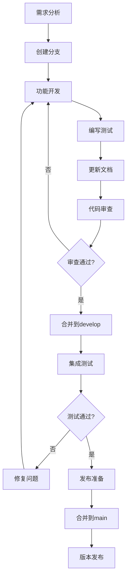

# 开发工作流指南

## 🎯 概述

本文档详细说明 TradingAgents 中文增强版的标准开发工作流程，确保团队协作的一致性和代码质量。

## 🔄 核心工作流程

### 工作流程图



## 🚀 详细工作流程

### 1. 功能开发工作流

#### 1.1 需求分析阶段
```bash
# 确认开发需求
# 1. 阅读需求文档或Issue描述
# 2. 确认技术方案和实现路径
# 3. 评估开发时间和资源需求
# 4. 与团队讨论技术细节
```

#### 1.2 分支创建阶段
```bash
# 确保本地develop分支是最新的
git checkout develop
git pull origin develop

# 创建功能分支
python scripts/branch_manager.py create feature risk-management-v2 -d "风险管理模块重构"

# 验证分支创建
git branch --show-current
# 应该显示: feature/risk-management-v2
```

#### 1.3 功能开发阶段
```bash
# 开发核心功能
# 1. 实现主要功能逻辑
git add tradingagents/risk/manager_v2.py
git commit -m "feat(risk): 实现新版风险管理器核心逻辑"

# 2. 添加配置支持
git add config/risk_management_v2.yaml
git commit -m "feat(config): 添加风险管理v2配置文件"

# 3. 集成到主框架
git add tradingagents/graph/trading_graph.py
git commit -m "feat(graph): 集成风险管理v2到交易图"

# 定期同步develop分支
git fetch origin
git rebase origin/develop  # 或使用 merge
```

#### 1.4 测试开发阶段
```bash
# 编写单元测试
git add tests/risk/test_manager_v2.py
git commit -m "test(risk): 添加风险管理v2单元测试"

# 编写集成测试
git add tests/integration/test_risk_integration.py
git commit -m "test(integration): 添加风险管理集成测试"

# 运行测试确保通过
python -m pytest tests/risk/ -v
python -m pytest tests/integration/test_risk_integration.py -v
```

#### 1.5 文档更新阶段
```bash
# 更新API文档
git add docs/api/risk-management.md
git commit -m "docs(api): 更新风险管理API文档"

# 添加使用示例
git add examples/risk_management_example.py
git commit -m "docs(examples): 添加风险管理使用示例"

# 更新配置文档
git add docs/configuration/risk-config.md
git commit -m "docs(config): 更新风险管理配置文档"
```

#### 1.6 代码审查阶段
```bash
# 推送分支到远程
git push origin feature/risk-management-v2

# 创建Pull Request
# 1. 访问GitHub仓库
# 2. 创建PR: feature/risk-management-v2 -> develop
# 3. 填写PR模板
# 4. 添加审查者
# 5. 等待审查反馈

# 根据审查意见修改代码
git add .
git commit -m "fix(risk): 根据审查意见修复代码风格问题"
git push origin feature/risk-management-v2
```

### 2. 中文增强开发工作流

#### 2.1 中文功能开发
```bash
# 创建中文增强分支
python scripts/branch_manager.py create enhancement akshare-integration -d "集成AkShare数据源"

# 开发中文数据源适配器
git add tradingagents/data/akshare_adapter.py
git commit -m "enhance(data): 添加AkShare数据源适配器"

# 添加中文金融术语支持
git add tradingagents/utils/chinese_terms.py
git commit -m "enhance(utils): 添加中文金融术语映射"

# 配置中文市场参数
git add config/chinese_markets/
git commit -m "enhance(config): 添加中国金融市场配置"
```

#### 2.2 中文文档开发
```bash
# 添加中文使用指南
git add docs/data/akshare-integration.md
git commit -m "docs: 添加AkShare集成中文指南"

# 更新中文示例
git add examples/chinese_market_analysis.py
git commit -m "examples: 添加中国市场分析示例"

# 更新中文FAQ
git add docs/faq/chinese-features-faq.md
git commit -m "docs: 添加中文功能常见问题"
```

### 3. 紧急修复工作流

#### 3.1 问题识别和评估
```bash
# 1. 确认问题严重程度
# 2. 评估影响范围
# 3. 制定修复方案
# 4. 确定修复时间线
```

#### 3.2 紧急修复开发
```bash
# 从main分支创建修复分支
git checkout main
git pull origin main
python scripts/branch_manager.py create hotfix memory-leak-fix -d "修复内存泄漏问题"

# 实施最小化修复
git add tradingagents/core/memory_manager.py
git commit -m "fix: 修复智能体内存泄漏问题"

# 紧急测试
python -m pytest tests/core/test_memory_manager.py -v
python tests/manual/memory_leak_test.py
```

#### 3.3 快速部署
```bash
# 推送修复
git push origin hotfix/memory-leak-fix

# 创建紧急PR到main
# 标记为紧急修复，跳过常规审查流程

# 合并后立即同步到develop
git checkout develop
git merge main
git push origin develop
```

### 4. 版本发布工作流

#### 4.1 发布准备
```bash
# 创建发布分支
python scripts/branch_manager.py create release v1.2.0-cn -d "v1.2.0中文增强版发布"

# 版本号更新
echo "1.2.0-cn" > VERSION
git add VERSION
git commit -m "bump: 版本更新到v1.2.0-cn"

# 更新变更日志
# 编辑CHANGELOG.md，添加新版本的变更内容
git add CHANGELOG.md
git commit -m "docs: 更新v1.2.0-cn变更日志"
```

#### 4.2 发布测试
```bash
# 完整测试套件
python -m pytest tests/ --cov=tradingagents --cov-report=html

# 性能测试
python tests/performance/benchmark_test.py

# 集成测试
python examples/full_integration_test.py

# 文档测试
# 验证所有文档链接和示例代码
```

#### 4.3 正式发布
```bash
# 合并到main
git checkout main
git merge release/v1.2.0-cn

# 创建版本标签
git tag -a v1.2.0-cn -m "TradingAgents中文增强版 v1.2.0"
git push origin main --tags

# 同步到develop
git checkout develop
git merge main
git push origin develop

# 清理发布分支
python scripts/branch_manager.py delete release/v1.2.0-cn
```

## 📋 工作流检查清单

### 功能开发检查清单
- [ ] **需求明确**: 功能需求和验收标准清晰
- [ ] **设计文档**: 有详细的技术设计文档
- [ ] **分支命名**: 使用规范的分支命名
- [ ] **代码质量**: 通过代码风格检查
- [ ] **单元测试**: 测试覆盖率达到80%以上
- [ ] **集成测试**: 通过集成测试
- [ ] **文档更新**: 更新相关API和使用文档
- [ ] **示例代码**: 提供使用示例
- [ ] **代码审查**: 至少一人审查通过
- [ ] **向后兼容**: 确保向后兼容性

### 中文增强检查清单
- [ ] **市场适配**: 适配中国金融市场特点
- [ ] **术语支持**: 支持中文金融术语
- [ ] **数据源**: 集成中文数据源
- [ ] **配置文件**: 添加中文市场配置
- [ ] **中文文档**: 完整的中文使用文档
- [ ] **示例代码**: 中文市场分析示例
- [ ] **测试用例**: 中文功能测试用例
- [ ] **兼容性**: 与国际化功能兼容

### 发布检查清单
- [ ] **功能完整**: 所有计划功能已实现
- [ ] **测试通过**: 完整测试套件通过
- [ ] **性能验证**: 性能测试达标
- [ ] **文档完整**: 所有文档已更新
- [ ] **版本标记**: 正确的版本号和标签
- [ ] **变更日志**: 详细的变更记录
- [ ] **发布说明**: 准备发布公告
- [ ] **回滚计划**: 有应急回滚方案

## 🔧 工具和自动化

### 开发工具
```bash
# 分支管理
python scripts/branch_manager.py

# 上游同步
python scripts/sync_upstream.py

# 代码质量检查
black tradingagents/
flake8 tradingagents/
mypy tradingagents/

# 测试运行
python -m pytest tests/ -v --cov=tradingagents
```

### CI/CD集成
- **GitHub Actions**: 自动化测试和部署
- **代码质量**: 自动代码风格和质量检查
- **测试覆盖**: 自动生成测试覆盖率报告
- **文档构建**: 自动构建和部署文档

## 📞 获取帮助

### 文档资源
- [分支管理策略](branch-strategy.md)
- [分支快速指南](../../BRANCH_GUIDE.md)
- [上游同步指南](../maintenance/upstream-sync.md)

### 联系方式
- **GitHub Issues**: [提交问题](https://github.com/hsliuping/TradingAgents-CN/issues)
- **邮箱**: hsliup@163.com

通过遵循这套标准化的开发工作流程，我们可以确保项目的高质量开发和稳定发布。
